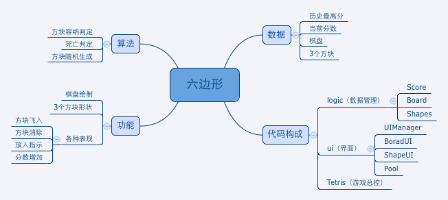

# 功能分析
首先分析游戏的功能点、算法和数据，然后依此制订代码组织结构。如下图：  

## 主要功能点
1. 棋盘的数据结构与绘制
2. 3个形状的生成
3. 形状拖拽填入棋盘
4. 行消除判定与死亡判定
5. 各种表现，例如消除动画、加分动画等

## 代码结构
将游戏逻辑（例如棋盘数据结构、死亡判定等）和界面逻辑分开，分别置于logic和ui界面。所有的UI界面交给UIManager脚本统一维护管理。
