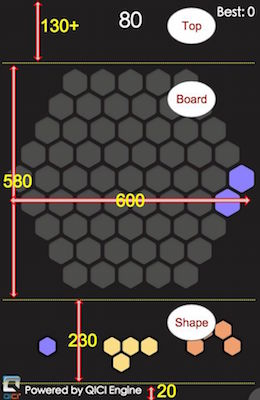
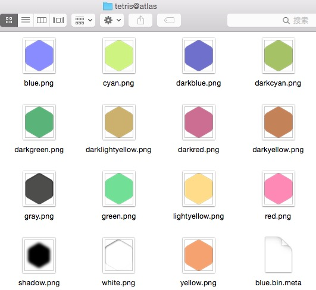
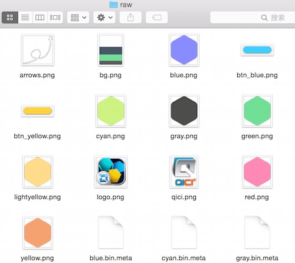

# 屏幕布局
在美术设计时，以640\*960分辨率（iPhone4）进行设计，其他分辨率的屏幕需要自适应。如下图：  
  

* 整个界面分为标题栏（Top）、棋盘（Board）、3个形状（Shapes）
	* Top：高度在iPhone4上为130。这里有两个信息：当前分数与历史最高分数
	* Board：棋盘，其大小为600\*580
	* Shapes：3个形状，大小为600\*230，距离底部20
* 自适应方案：
    * 以	640\*960为基准，等比缩放，确保所有内容都能全部显示
    * 当分辨率比较瘦长时（即Height/Width > 960/640）时，Board和Shapes保持和底部位置不变（方便单手操作）。Top高度自动增加
    * 当分辨率比较宽时（即Height/Width < 960/640）时，Board和Shapes保持居中，两边留白

    
<video controls="controls" src="../video/layout.mp4"></video>

    

## 导入资源
1. 新建文件夹：Assets/atlas/tetris@atlas，将以下文件拖入并打包图集（图片请在示例工程中查看）
  
    
格子在没有数据时，显示gray.png。其他形状的格子颜色，有6种（blue、cyan、green、lightyellow、yellow、red）  

2. 将以下文件拖入文件夹Assets/raw（raw目录下的资源都不会被打包，例如图片直接原样保留，适用于css样式表指定资源） 

      
各图片的用途在后续中会说明。

## 界面布局
1. 创建UIRoot，并设置Reference Resolution（参考分辨率）为 640\*960，Manual Type为Expand（默认值就是这样的配置）
简单的理解：设置了以后，就可以认为屏幕的宽度>=640，高度>=960

2. 创建棋盘。棋盘大部分情况下是“静态”的，只是在有新的形状放入时才会变化。如果棋盘的每个格子作为UIImage进行贴图，则每帧都需要重绘几十个格子图片，对渲染效率会有所影响。这里我们适用DOM方案，里面每个格子使用div进行绘制。因此创建一个DOM节点，设置其大小为：600\*580，同时由于棋盘距离底部的位置固定，因此在布局上：水平居中、垂直距离底部250，自身中心点在底部中心位置。

3. 添加一个Node节点，挂载3个形状。Node大小为 600\*230，距离底部20。

4. 创建DOM节点显示历史最高分（不常变化，因此不用UIText，使用Dom更高效）。本节点大小为200\*60，距离屏幕右边20，顶部20。

5. 创建DOM节点显示当前分（不常变化，因此不用UIText，使用Dom更高效）。本节点大小为200\*80，水平居中，顶部顶部29。

6. 运行查看下效果，由于DOM文本的默认颜色为黑色，和背景很接近，比较不容易看清

__视频操作：__  
<video controls="controls" src="../video/create_layout.mp4"></video>
