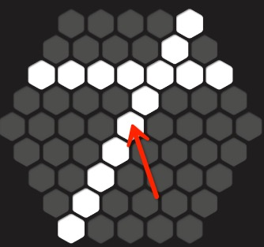

# 消除行格子预置

效果图：。
由这些预置构成了一个完整的行（后续用来做消除效果表现）：。  

1. 在节点__pool__下创建Image节点：__LineBlock__，水平、垂直居中，大小为61\*67，pivot=(0.5, 0.5)，并设置贴图为white.png

2. 将__LineBlock__拖入到Assets/prefabs目录，创建预置。然后删除__LineBlock__节点

3. 查看下看是否显示正常  

__视频操作：__  
<video controls="controls" src="../video/create_line_block.mp4"></video>