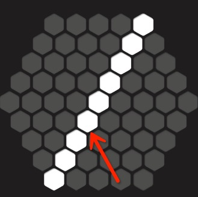
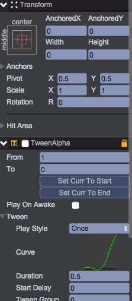

# 行消除动画
本节实现当可以消除时，播放的消除动画，如下图所示：  
  
  
## line预置  
1. 在__board__节点下，创建一空节点line。水平和垂直居中，anchoredX=anchoredY=Width=Height=0，Pivot=(0.5,0.5)  
2. 在line挂载TweenAlpha脚本，透明度从1变化到0，播放淡出的效果，如下图：  
  
3. 在Scripts/ui创建脚本LineUI.js  
````javascript
    /**
     * 消除一行的表现界面
     */
    var LineUI = qc.defineBehaviour('qc.tetris.LineUI', qc.Behaviour, function() {
        var self = this;
    
        // 描述行的信息
        self.flag = 'xy';
        self.x = 0;
        self.y = 0;
    }, {
        blockPrefab: qc.Serializer.PREFAB
    });
    
    Object.defineProperties(LineUI.prototype, {
        /**
         * 取得行标记
         */
        key: {
            get: function() {
                return this.flag + qc.Tetris.makePos(this.x, this.y);
            }
        },
    
        /**
         * 取得本行的格子数量
         */
        count: {
            get: function() {
                return this.gameObject.children.length;
            }
        }
    });
    
    /**
     * 初始化行
     */
    LineUI.prototype.init = function(flag, start, end) {
        var self = this;
        self.flag = flag;
        self.x = start[0];
        self.y = start[1];
    
        // 创建一个格子
        var createBlock = function(pos) {
            var block = self.game.add.clone(self.blockPrefab, self.gameObject);
            block.frame = 'white.png';
            block.anchoredX = qc.Tetris.board.data[pos].x;
            block.anchoredY = qc.Tetris.board.data[pos].y;
            block.name = pos;
            return block;
        };
    
        switch (flag) {
        case 'xy':
            for (var x = self.x, y = self.y; true;) {
                createBlock(qc.Tetris.makePos(x, y));
    
                // 下一个点
                if (end[0] > start[0]) {
                    x++, y--;
                    if (x > end[0]) break;
                }
                else {
                    x--, y++;
                    if (x < end[0]) break;
                }
            }
            break;
    
        case 'y':
            for (var x = start[0], y = start[1]; x <= end[0];) {
                createBlock(qc.Tetris.makePos(x, y));
                x++;
            }
            break;
    
        case 'x':
            for (var x = start[0], y = start[1]; y <= end[1];) {
                createBlock(qc.Tetris.makePos(x, y));
                y++;
            }
        }
    
        // 初始时隐藏掉
        self.gameObject.name = self.key;
        self.gameObject.visible = false;
    };
    
    /**
     * 播放消失的动画
     */
    LineUI.prototype.playDisappear = function() {
        var self = this,
            o = self.gameObject,
            ta = self.getScript('qc.TweenAlpha');
    
        o.visible = true;
        ta.resetToBeginning();
        ta.onFinished.addOnce(function() {
            // 隐藏掉
            o.visible = false;
        });
        ta.playForward();
    };
````
4. 将__LineUI.js__脚本挂载到line节点，并设置blockPrefab为Assets/prefab/LineBlock.bin  
5. 将line节点拖到Assets/prefab创建预置，然后从场景中删除  

视频演示：  
<video controls="controls" src="../video/create_line_prefab.mp4"></video>

## 创建所有的行表现对象池
1. 打开__Board.js__代码文件，在构造函数中增加3个变量的初始化：  
````javascript
    var Board = qc.Tetris.Board = function() {
        // ...
    
        // 左斜的9条线
        self.xyLines = [
            [0, -4],
            [1, -4],
            [2, -4],
            [3, -4],
            [4, -4],
    
            [4, -3],
            [4, -2],
            [4, -1],
            [4, 0]
        ];
    
        // 横向9条线
        self.yLines = [
            [0, -4, 5],
            [-1, -3, 6],
            [-2, -2, 7],
            [-3, -1, 8],
            [-4, 0, 9],
            [-4, 1, 8],
            [-4, 2, 7],
            [-4, 3, 6],
            [-4, 4, 5]
        ];
    
        // 右斜9条线
        self.xLines = [
            [-4, 0, 5],
            [-3, -1, 6],
            [-2, -2, 7],
            [-1, -3, 8],
            [0, -4, 9],
            [1, -4, 8],
            [2, -4, 7],
            [3, -4, 6],
            [4, -4, 5]
        ];
    };
````
2. 在ui下创建脚本__KillLineEffect.js__  
````javascript
    var KillLineEffect = qc.defineBehaviour('qc.tetris.KillLineEffect', qc.Behaviour, function() {
        var self = this;
    
        /**
         * 所有的行
         */
        self.lines = {};
    }, {
        linePrefab: qc.Serializer.PREFAB
    });
    
    /**
     * 初始化：将用于表现的行全部创建出来放着
     */
    KillLineEffect.prototype.awake = function() {
        var self = this;
    
        // 创建用于消除表现的格子行
        var createLine = function(flag, start, end) {
            var ob = self.game.add.clone(self.linePrefab, self.gameObject);
            var line = ob.getScript('qc.tetris.LineUI');
            line.init(flag, start, end);
            self.lines[line.key] = line;
        };
        var pts = qc.Tetris.board.xyLines;
        for (var i = 0; i < pts.length; i++) {
            var start = pts[i], end = [start[1], start[0]];
            createLine('xy', start, end);
        }
    
        var pts = qc.Tetris.board.yLines;
        for (var i = 0; i < pts.length; i++) {
            var start = pts[i], end = [start[0] + start[2] - 1, start[1]];
            createLine('y', start, end);
    
        }
        var pts = qc.Tetris.board.xLines;
        for (var i = 0; i < pts.length; i++) {
            var start = pts[i], end = [start[0], start[1] + start[2] - 1];
            createLine('x', start, end);
        }
    };
    
    KillLineEffect.prototype.find = function(flag) {
        return this.lines[flag];
    };
    
    KillLineEffect.prototype.play = function(index, flag, score) {
        var self = this;
        var line = self.find(flag);

        // 消失动画
        line.playDisappear();
    };
````
3. 将__KillLineEffect.js__挂载到节点__board__，并设置linePrefab属性为开始创建的预置：line
4. 运行游戏，查看board下挂载的节点，并检查下  

视频演示：  
<video controls="controls" src="../video/kill_line.mp4"></video>