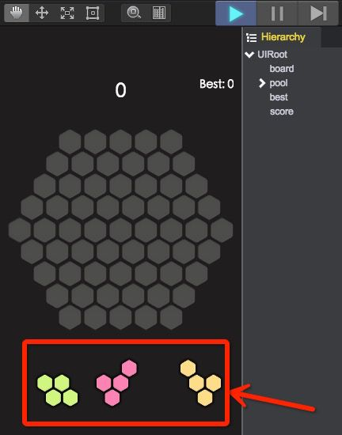

# 显示出3个形状

1. 在Scripts/ui创建文件：Pool.js，绘制3个形状。
````javascript   
	var s = qc.Serializer;

	/**
	 * 3个形状的绘制
	 */
	var Pool = qc.defineBehaviour('qc.tetris.Pool', qc.Behaviour, function() {
	    var self = this;

	    /**
	     * 形状的预置
	     */ 
	    self.shapePrefab = null;

	    /**
	     * 记录下面3个形状的实例
	     */
	    self.shapes = [];
	}, {
	    shapePrefab: s.PREFAB
	});

	/**
	 * 初始化处理
	 */
	Pool.prototype.awake = function() {
	    var self = this;
	    self.redraw();
	};

	/**
	 * 绘制3个形状
	 */
	Pool.prototype.redraw = function() {
	    var self = this;

	    // 先干掉旧的形状数据
	    for (var i = 0; i < self.shapes.length; i++) {
	        self.shapes[i].destroy();
	    }
	    self.shapes = [];

	    // 创建3个新的形状
	    for (i = 0; i < 3; i++) {
	        self.add(i);
	    }
	    self.resize();
	};

	/**
	 * 调整位置
	 */
	Pool.prototype.resize = function() {
	    var self = this, o = self.gameObject;

	    // 计算X方向的偏移
	    var offset = o.width * (0.5 - 0.165);
	    for (var i = 0; i < 3; i++) {
	        var child = self.shapes[i];
	        if (!child) return;
	        child.anchoredX = offset * (i - 1);
	        child.anchoredY = 0;
	    }
	};

	/**
	 * 添加一个形状
	 */
	Pool.prototype.add = function(index) {
	    var self = this;

	    var o = self.game.add.clone(self.shapePrefab, self.gameObject);
	    var c = o.getScript('qc.tetris.ShapeUI');
	    c.data = qc.Tetris.Shapes.pool[index];
	    self.shapes[index] = o;
	};

	/**
	 * 删除一个形状
	 */
	Pool.prototype.remove = function(index) {
	    var o = this.shapes[index];
	    o.destroyImmediately();
	    this.shapes.splice(index, 1);
	};
````
整个代码逻辑比较简单，根据3个形状的数据进行绘制。请参考注释进行理解。  

2. 将此脚本挂载到UIRoot/pool节点，关联shapePrefab为：Assets/prefab/Shape.bin  

3. 运行测试下效果，3个形状正确显示了：  
  