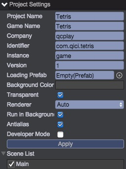
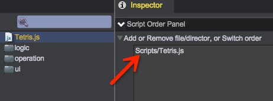

# 创建工程与场景
创建工程Tetris和空的主场景Main，设置如下：  
  
__本工程中，画布背景(background)设置为透明__

## 游戏入口与游戏初始化
在Scripts目录下创建文件：__Tetris.js__。代码如下：  
````javascript
	/**
	 * 游戏入口
	 */
	window.Tetris = qc.Tetris = {
		// 所有的操作指令集合
		operation: {}
	};

	// 游戏逻辑初始化
	qc.initGame = function(game) {
		// 将游戏实例记录下来，便于访问
	    Tetris.game = game;

	    // 帧率显示为60帧（满帧）
	    game.time.frameRate = 60;
	};
````
设置此脚本为入口脚本（第一个加载）：  
  
此脚本首先定义了名字空间，将全局的数据都记录在qc.Tetris，防止名字污染。  
游戏入口中，记录了game的实例并将帧率限定为60帧（默认在手机下为30帧）