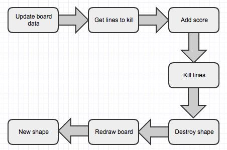

# 形状放入棋盘的实现
处理流程如下图：  
  

1. 打开文件Scripts/operation/PutIn.js，实现上述代码：
````javascript   
	/**
	 * 请求放入指定格子，如果成功放入返回true，否则返回false
	 */
	qc.Tetris.operation.putIn = function(index, pos) {
	    var shape = qc.Tetris.Shapes.pool[index],
	        board = qc.Tetris.board,
	        ui = qc.Tetris.game.ui,
	        log = qc.Tetris.game.log;
	    log.trace('尝试将({0})放入({1})', index, pos);

	    if (!board.checkPutIn(pos, shape.list)) {
	        // 禁止放入
	        return false;
	    }
	    log.trace('放入格子：({0})', pos);

	    // 更新棋盘信息
	    board.putIn(pos, shape.list, shape.value);

	    // 计算可以消除的行，并同时消除掉
	    var lines = board.getFullLines();
	    lines.forEach(function(flag) {
	        var children = ui.killLineEffect.find(flag).gameObject.children;
	        var pts = [];
	        children.forEach(function(child) { pts.push(child.name); });
	        board.clearLine(pts);
	    });

	    // 计算分数明细，并添加之
	    var scoreDetail = qc.Tetris.operation.calcScore(lines);
	    qc.Tetris.score.current += scoreDetail.total;

	    // 替换为新的形状
	    qc.Tetris.Shapes.pool.splice(index, 1);
	    qc.Tetris.Shapes.pool.push(qc.Tetris.Shapes.random());

	    // 重新绘制棋盘
	    ui.board.redraw();

	    // 行消除与分数增加的动画表现
	    if (lines.length > 0) {
	        for (var i = 0; i < lines.length; i++) {
	            ui.killLineEffect.play(i, lines[i], scoreDetail.lines[i]);
	        }
	    }

	    // 当前分数的动画表现
	    ui.currentScore.setScore();

	    // 形状飞入的动画表现，并将旧的形状删除掉
	    ui.pool.remove(index);
	    ui.pool.add(2);
	    ui.pool.flyIn(index);

	    // 死亡检测
	    if (board.die) {
	        // 延迟显示死亡界面
	        log.trace('Game Over!');
	        qc.Tetris.game.timer.add(3000, function() {
	            ui.onDie();
	        });
	    }

	    // 放入成功了
	    return true;
	};
````
2. 选中UIRoot节点，将killLineEffectNode关联到__board__节点  
3. 运行游戏，我们发现可以正常的放入形状、消除行了。至此，整个游戏已经接近完成了
