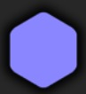
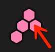

# 形状格子预置

效果图：。
由这些预置构成了一个完整的形状：  

1. 在节点__pool__下创建空节点：__ShapeBlock__，水平、垂直居中，大小为61\*64，pivot=(0.5, 0.5)

2. 在__ShapeBlock__下创建Image节点：__shadow__，水平、垂直居中，大小为60\*65，pivot=(0.5, 0.5)，并设置贴图为shadow.png

3. 在__ShapeBlock__下创建Image节点：__block__，水平、垂直居中，大小为40\*45，pivot=(0.5, 0.5)，并设置贴图为white.png

4. 将__ShapeBlock__拖入到Assets/prefabs目录，创建预置。然后删除__ShapeBlock__节点

5. 查看下看是否显示正常  

__视频操作：__  
<video controls="controls" src="../video/create_shape_block.mp4"></video>