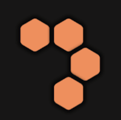
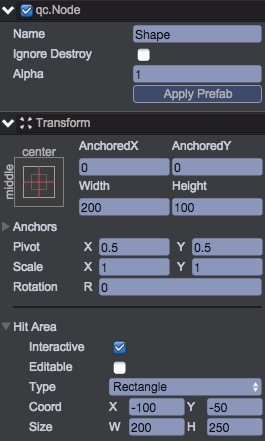

# 形状预置

效果图：。    

1. 在__pool__节点下，创建一空的Node节点，设置如下图：  
  
* 定位在父亲的中心点
* 大小为200\*100
* pivot设置为：(0.5, 0.5)
* 本对象需要可以交互（需要被拖放），勾选Interactive。并设置碰撞盒类型为Rectangle（正方形），按图示设置大小（碰撞盒大小会比节点实际大小更大）  

2. 在Scripts/ui创建文件ShapeUI.js
````javascript
	/**
	 * 绘制一个形状
	 */
	var ShapeUI = qc.defineBehaviour('qc.tetris.ShapeUI', qc.Behaviour, function() {
	    var self = this;

	    // 格子的预置，一个形状下有多个格子
	    self.blockPrefab = null;

	    // 下属所有的格子
	    self._blocks = {};
	}, {
	    blockPrefab: qc.Serializer.PREFAB
	});

	Object.defineProperties(ShapeUI.prototype, {
	    /**
	     * 关联的数据
	     */
	    data: {
	        get: function() { return this._data; },
	        set: function(v) {
	            this._data = v;
	            this.redraw();
	        }
	    },

	    /**
	     * 第几个？
	     */
	    index: {
	        get: function() {
	            return this.gameObject.parent.getChildIndex(this.gameObject);
	        }
	    }
	});

	/**
	 * 初始化
	 */
	ShapeUI.prototype.awake = function() {
	    // 点击时的偏移量
	    var self = this;
	    self.offsetY = self.game.device.desktop ? 0 : 50;
	};

	/**
	 * 重新绘制区块
	 */
	ShapeUI.prototype.redraw = function() {
	    var self = this;
	    var frame = qc.Tetris.IMAGES[self.data.value];
	    self.data.list.forEach(function(pos) {
	        var x = pos[0], y = pos[1];
	        var block = self.game.add.clone(self.blockPrefab, self.gameObject);
	        block.find('block').frame = frame + '.png';
	        block.name = x + '_' + y;
	        self._blocks[qc.Tetris.makePos(x, y)] = block;
	    });
	    self.reset();
	};

	/**
	 * 重设区块大小和排列下属格子的位置
	 */
	ShapeUI.prototype.reset = function() {
	    var self = this, o = self.gameObject;
	    for (var pos in self._blocks) {
	        var p = qc.Tetris.readPos(pos);
	        var pt = qc.Tetris.board.toWorld(p, qc.Tetris.POOL_DISTANCE_NORMAL);
	        var block = self._blocks[pos];
	        block.anchoredX = pt.x;
	        block.anchoredY = pt.y;
	    }
	};
````
	* 本脚本根据形状的数据，动态创建出格子并显示出来
	* blockPrefab为形状格子的预置
	* 形状的大小会比棋盘中显示小，因此计算格子的屏幕坐标时，指明了常量：qc.Tetris.POOL_DISTANCE_NORMAL
	* 在初始化时，设置了非PC模式下需要做偏移为50。（在手机上拖拽时形状容易被手指完全挡住）
	
3. 将ShapeUI.js挂载到__Shape__节点，并设置blockPrefab为Assets/prefab/ShapeBlock.bin  

4. 修改Tetris.js，加入POOL_DISTANCE_NORMAL配置：
````javascript
	window.Tetris = qc.Tetris = {
	    // 棋盘的大小（半径）
	    SIZE: 4,
	    
	    // 棋盘中，每个格子的宽度和高度
	    BLOCK_W: 61,
	    BLOCK_H: 67,
	    
	    // 没有点击时，格子之间的距离
	    POOL_DISTANCE_NORMAL: 45,

	    ...
````

5. 将__Shape__节点拖入到目录Assets/prefab，创建预置。然后将节点从场景中删除。  

5. 此时形状预置创建完毕，但我们无法进行测试，为此写个编辑器下的测试代码：
    * 在Editor目录下，创建脚本ShapeEditor.js
    ````javascript
    G.extend.menu('Test/Shape', function() {
        var game = G.game;
        game.assets.load('Assets/prefab/Shape.bin', function(prefab) {
            var shape = game.add.clone(prefab, game.world.find('UIRoot/pool'));
            var c = shape.getScript('qc.tetris.ShapeUI');
        
            c.data = qc.Tetris.Shapes.random();
        });
        
    });
    ````
    * 运行游戏，点击主菜单Test/Shape，在屏幕底部出现了一个随机的形状，测试OK

__视频操作：__  
<video controls="controls" src="../video/create_shape_prefab.mp4"></video>