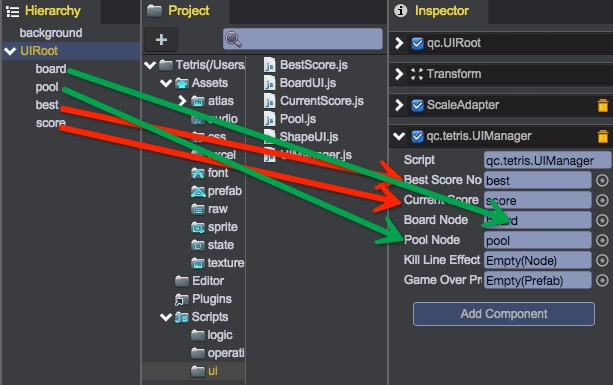

# 界面管理
在多个游戏界面之间，需要相互协作，这里创建个脚本统一来维护所有游戏界面。  

1. 在Scripts/ui新建UIManager.js：  
````javascript
	/**
	 * 负责管理所有的游戏界面
	 */
	var UIManager = qc.defineBehaviour('qc.tetris.UIManager', qc.Behaviour, function() {
	    var self = this;
	    self.game.ui = self;

	    self.runInEditor = true;
	}, {
	    bestScoreNode: qc.Serializer.NODE,
	    currentScoreNode: qc.Serializer.NODE,
	    boardNode: qc.Serializer.NODE,
	    poolNode: qc.Serializer.NODE,
	    killLineEffectNode: qc.Serializer.NODE,
	    gameOverPrefab: qc.Serializer.PREFAB
	});

	/**
	 * 初始化管理
	 */
	UIManager.prototype.awake = function() {
	    var self = this;

	    /**
	     * bestScore: BestScore组件
	     */
	    if (self.bestScoreNode)
	        self.bestScore = self.bestScoreNode.getScript('qc.tetris.BestScore');

	    /**
	     * currentScore: CurrentScore组件
	     */
	    if (self.currentScoreNode)
	        self.currentScore = self.currentScoreNode.getScript('qc.tetris.CurrentScore');

	    /**
	     * board: 棋盘绘制组件
	     */
	    if (self.boardNode)
	        self.board = self.boardNode.getScript('qc.tetris.BoardUI');

	    /**
	     * pool: 3个形状的方块
	     */
	    if (self.poolNode)
	        self.pool = self.poolNode.getScript('qc.tetris.Pool');

	    /**
	     * killLineEffect: 方块消除的动画组件
	     */
	    if (self.killLineEffectNode)
	        self.killLineEffect = self.killLineEffectNode.getScript('qc.tetris.KillLineEffect');
	};

	/**
	 * 游戏重新开始的界面处理
	 */
	UIManager.prototype.restart = function() {
	    var self = this;

	    // 重新生成3个新的形状
	    self.pool.redraw();

	    // 棋盘重绘制
	    self.board.redraw();

	    // 重绘当前分数
	    self.currentScore.setScore();
	};

	/**
	 * 死亡的处理
	 */
	UIManager.prototype.onDie = function() {
	    // 显示失败页面
	    this.game.add.clone(this.gameOverPrefab, this.gameObject);
	};
````
	UIManager引用了几个界面逻辑，部分界面逻辑后续会逐一实现

2. 将脚本挂载到UIRoot，并关联各属性（不存在的先留空）：  
  	

__视频演示：__  
<video controls="controls" src="../video/create_uimanager.mp4"></video>