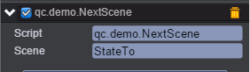

# 场景切换

* 本范例演示场景切换功能。<br>


## 添加loading动画

* 制作过场动画可参考[《场景动画效果》](http://docs.zuoyouxi.com/manual/LoadingPrefab/index.html)

## UI

* 演示场景切换需要创建两个场景，分别为StateFrom.bin和StateTo.bin。<br>

### 场景StateFrom.bin

* 在场景中创建一个Button，点击按钮切换场景以查看进度框。<br>
* 场景脚本NextScene.js，负责切换到指定场景的逻辑，并演示预加载和载入成功后异步加载，脚本挂在Button节点上。如下图：<br>
<br>
* 代码如下：<br>

```javascript
/**
 * 点击切换到指定的场景
 */
var NextScene = qc.defineBehaviour('qc.demo.NextScene', qc.Behaviour, function() {
    // 初始化代码
    this.scene = '';
}, {
    // 需要序列化的字段
    scene: qc.Serializer.STRING
});

// 节点被点击了，切换场景
NextScene.prototype.onClick = function() {
    // 切换到指定场景
    var self = this;
    var load = function() {
        self.game.state.load(self.scene, false, function() {
            // 方式1：预加载中，我们可以做一些资源的加载操作
            self.game.assets.load('loadSync', 'Assets/atlas/pic.bin');
        }, function() {
            console.log(self.scene + '场景加载完毕。');

            self.game.world.find('UIRoot/UIText').text =
                '切场景成功。\n' +
                '注意下面2图分别演示了：\n' +
                'preload中预加载、载入成功后异步加载。\n' +
                '详细见 Scripts/nextScene.js 中的处理。';

            // 这里面预加载的资源一定都已经加载完毕可以供后续游戏使用，用于自定资源的预加载
            var node = self.game.world.find('syncShow');
            if (!node) {
                node = self.game.add.image();
                node.name = 'syncShow';
                node.x = 10;
                node.y = 120;
            }
            node.texture = self.game.assets.find('loadSync');

            // 方式2：异步加载，结束回调后资源为可用状态
            self.game.assets.load('loadAsync', 'Assets/atlas/loadAsync.bin', function(asset) {
                var nodeAsync = self.game.world.find('asyncShow');
                if (!nodeAsync) {
                    nodeAsync = self.game.add.image();
                    nodeAsync.name = 'asyncShow';
                    nodeAsync.x = 160;
                    nodeAsync.y = 120;
                }

                // 设置异步加载好的资源
                nodeAsync.texture = asset;
                // or
                // nodeAsync.texture = self.game.assets.find('loadAsync');
            });
        });
    };
    self.game.timer.add(1, load);
}
```

### 场景StateTo.bin

* 在场景中创建一个Text，用来提示从StateFrom.bin场景启动。

