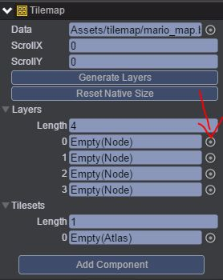
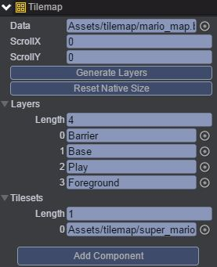
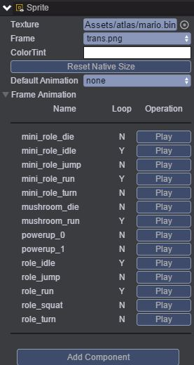
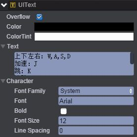
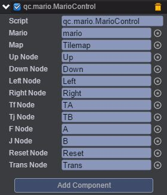
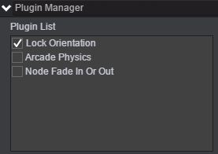
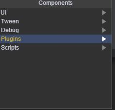
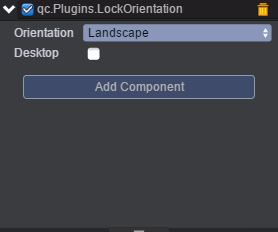

# 超级玛丽
本范例通过超级玛丽游戏演示怎样制作地图及导入地图到游戏场景中，运行时，通过键盘方向键控制mario节点的方向移动、跳、加速、重置、变形，还可以通过点击界面上的功能键实现特定的功能，效果图如下： 

# UI
## 制作地图
* 制作地图及将地图导入到场景中可参考[《TileMap》](http://docs.zuoyouxi.com/manual/Tilemap/index.html)。 
## node节点
* 在UIRoot节点下创建一个Empty Node节点并取名为node。 
* 在node节点下创建Tilemap节点，该节点用于放置地图图层，通过Inspector面板设置Tilemap属性，如下图： 

* 点击上图的红色箭头所指向的按钮，添加Barrier、Base、Play及Foreground节点，再把tilemap文件夹下的super_mario.bin文件拖入到Tilesets选项方框中，如下图： 

* 在Play节点下创建Sprite节点并取名mario，为该节点添加帧动画，编辑帧动画可参考[《编辑帧动画》](http://docs.zuoyouxi.com/manual/FrameAnimation/index.html)，添加完后如下图： 

* 在node节点下创建Text节点并命名UIText，文本信息设置为如下图所示： 

* 在node节点下创建一个Text节点并命名debug，把调试信息挂载到该节点上。 
## dir节点
* 在dir节点下创建四个Button节点，分别命名Up、Left、Right、Down，这四个按钮可以控制mario节点的上下左右方向，如下图： 

## op
* 创建一个Empty Node节点并取名op。 
* 在op节点下创建四个Button节点，分别命名TA、TB、A、B。如下图所示： 

## menu节点
* 创建一个Empty Node节点并取名menu。 
* 在menu节点下创建两个Button节点并分别取名Reset、Trans。这两个按钮的作用是重置、变形，如下图： 

## 挂载脚本
* 在Scripts文件夹下创建脚本MarioControl.js、CollideControl.js，完整代码可查看DEMO源代码，把MarioControl.js脚本挂载到node节点上，如下图： 

## node1节点
* 创建一个Empty Node节点并取名node1，该节点用于挂载锁屏插件，步骤是点击菜单栏上的Plugins\Plugin Manager，把Lock Orientation勾选上，出现如下界面： 

* 通过Inspector面板点击Add Component，出现如下界面： 

* 选择Plugins\LockOrientation，出现如下界面： 

Orientation有Landscape（横向）与Portrait（竖向）可选。 

