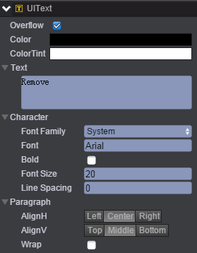
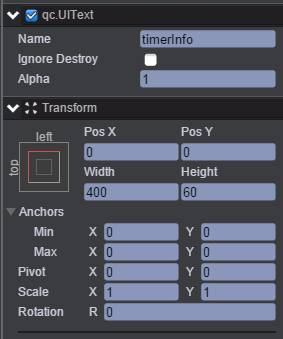
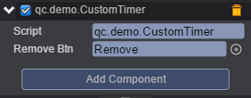

# 定时器
* 本范例演示创建定时器及移除定时器，运行时，计数器从1开始计数，每隔两秒加一，效果图如下：<br>


## UI
* 创建一个Button并命名为Remove，Button下的Text文本信息设置为Remove，如下图：<br>


* 创建一个UIText并取名timerInfo用来显示定时器计数信息。如下图：<br>



* 在Scripts文件下创建脚本CustomTimer.js，该脚本用于定时器计数及点击响应事件，具体代码如下所示：<br>

* 代码入戏：<br>

```javascript
var CustomTimer = qc.defineBehaviour('qc.demo.CustomTimer', qc.Behaviour, function() {
    this.total = 0;
    this.removeBtn = null;
}, {
    removeBtn: qc.Serializer.NODE
});

CustomTimer.prototype.awake = function() {
    var self = this;
    
    // 创建定时器
    var timer = self.timer = self.game.timer.loop(1000, self.updateCounter, self);

    // 移除定时器
    self.removeBtn.onClick.add(function() {
        self.game.timer.remove(timer);
        delete self.timer;
    });
};

CustomTimer.prototype.updateCounter = function() {
    this.total++;
    this.gameObject.text = 'Loop Count: ' + this.total;
};   
```
* 将该CustomTimer.js脚本挂载到timerInfo节点上，见下图：<br>




