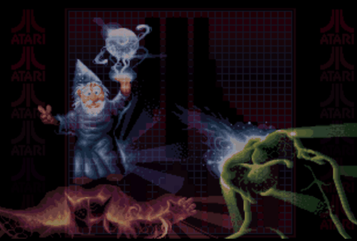
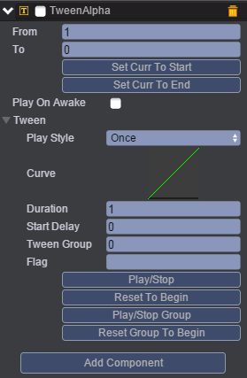
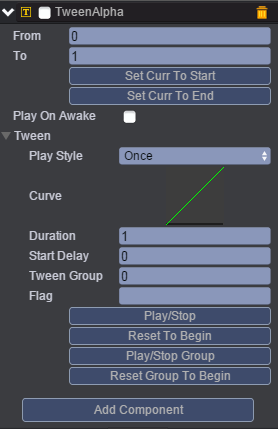
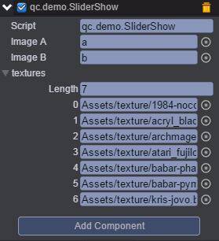

# 图片轮换
* 本范例演示定时切换图片，运行时，每隔3秒切换一张图片，总共7张图片，依次轮换。效果图如下：<br>


##UI
* 创建两个Image并分别取名为a，b，用于切换图片。<br>
* 在a节点上挂载TweenAlpha动画，如下图所示：<br>


* 同样在b节点上挂载TweenAlpha动画，如下图所示：<br>


* 说明：<br>
* 透明度From 1 To 0 即图片逐渐消失，而From 0 To 1则图片渐渐出现；<br>
* Play Style有三种分别为Once（一次）、PingPong（来回）、Loop（循环），该范例选择Once；<br>
* Duration为1（持续的时间为1秒）；<br>
* 在Script文件夹下创建脚本SliderShow.js，把该脚本挂载到UIRoot上，并把a，b两个节点拖动Image A，Image B选项方框中，具体见下图所示，其中图片的张数设置Length为7张图片，第一张图片为Assets/texture/1984-nocooper-space.bin，依次进行轮换。<br>



* 代码如下：<br>

```javascript

var SliderShow = qc.defineBehaviour('qc.demo.SliderShow', qc.Behaviour, function() {
    this.textures = [];
    this.imageA = null;
    this.imageB = null;
}, {
    imageA: qc.Serializer.NODE,
    imageB: qc.Serializer.NODE,
    textures: qc.Serializer.TEXTURES
});

SliderShow.prototype.onEnable = function() {
    var self = this;

    // 初始化第一张图片
    self.imageA.texture = self.textures[0];
    self.imageA.resetNativeSize();
    self.imageA.alpha = 1;
    self.imageB.alpha = 0;
    self.index = 0;

    self.timer = self.game.timer.add(3000, self.fadePictures, self);    
};

SliderShow.prototype.fadePictures = function() {
    var self = this;
    self.index++;
    if (self.index >= self.textures.length) self.index = 0;

    var fadeOut = self.imageA.alpha === 0 ? self.imageB : self.imageA,
        fadeIn = self.imageA.alpha !== 0 ? self.imageB : self.imageA;
    var ta1 = fadeOut.getScript('qc.TweenAlpha'),
        ta2 = fadeIn.getScript('qc.TweenAlpha');
    fadeIn.texture = self.textures[self.index];
    fadeIn.resetNativeSize();

    // Fade Out
    ta1.from = 1;
    ta1.to = 0;
    ta1.resetToBeginning();
    ta1.playForward();

    // Fade In
    ta2.from = 0;
    ta2.to = 1;
    ta2.resetToBeginning();
    ta2.onFinished.addOnce(function() {
        // 轮换图片
        self.timer = self.game.timer.add(3000, self.fadePictures, self);
    });
    ta2.playForward();
};   
```