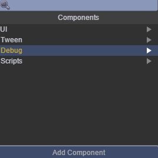

# Time 属性
本范例介绍Time属性，now表示现在的时间（1970-01-01午夜到现在的时间间隔，用毫秒表述），fixedTime表示以毫秒秒计自游戏开始的时间，scaledTime自游戏开始后经历的时间，timeScale表示控制时间的快慢，frameRate表示游戏帧率，deltaTime表示最后一帧到当前帧的时间间隔（单位毫秒），运行时，绿色字体为Time 属性，白色字体为调试信息，效果图如下： 

## UI
* 界面布局略，需要说明的是如何产生调试信息，步骤如下： 
* 通过Inspector面板点击debug节点（debug为Text节点）Add Component，出现如下界面： 

* 再选择Debug\DebugViewer，此时在Inspector面板出现如下界面即可产生调试信息： 

