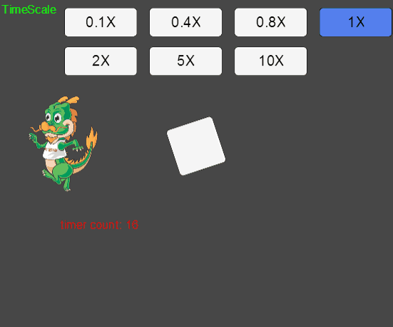
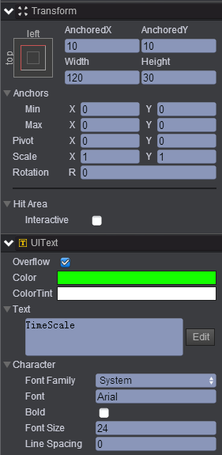
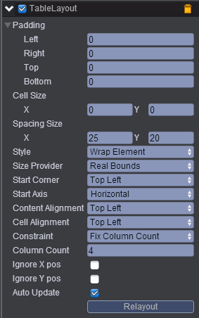
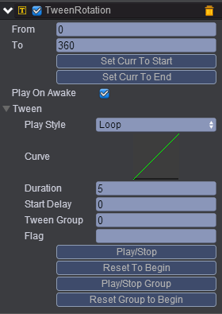
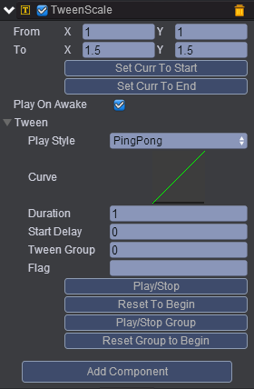
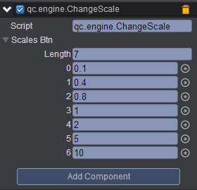

# TimeScale   
* 本范例介绍游戏加速和减速，演示“TimeScale”的使用，TimeScale属性可查阅文档[手册](http://docs.zuoyouxi.com/api/time/index.html)，运行时，效果图如下：<br>   
   

## UI   
* 在UIRoot节点下创建一个Text节点取名clue，该节点的属性值设置如下图：<br>    
      
* 在UIRoot节点下创建一个Empty Node节点取名scales，在该节点下挂载TableLayout组件，该组件用于排版挂载到scales子节点，挂载完成后设置其属性值如下所示：<br>   
     
 
* 属性的具体信息请查阅文档，[手册](http://docs.zuoyouxi.com/api/components/TableLayout.html)。<br>    
* 在scales节点下创建七个Button节点，按钮的Text属性值设置为0.1X、0.4X、0.8X、1X、2X、5X、10X、运行时，按下对应的按钮可改变TimeScale。<br>   
* 在UIRoot节点下创建一个Sprite节点，在该节点下添加骨骼动画，可参考[手册](http://docs.zuoyouxi.com/manual/DragonBone/index.html)。<br>    
* 在UIRoot节点下创建一个Image节点取名tween，将TweenRotation组件与TweenScale组件挂载到该节点，挂载Tween组件及属性具体信息请查阅文档，[手册](http://docs.zuoyouxi.com/manual/Tween/index.html)。<br>   
* 挂载Tween组件完成后设置其属性值如下图所示：<br>     
* TweenRotation:<br>      
   
     

* TweenScale:<br> 
      
     

* 在UIRoot节点下创建一个Text文本节点取名timer，该节点用于显示计时。<br>    
* 在Scripts文件夹下创建脚本ChangeScale.js，把该脚本挂载到scales节点，并把相应的节点拖入到对应的属性框，如下图所示：<br>     
    

* 代码如下：<br>     

```javascript    
var ChangeScale = qc.defineBehaviour('qc.engine.ChangeScale', qc.Behaviour, function() {
    
}, {
    scalesBtn: qc.Serializer.NODES
});

//初始化
ChangeScale.prototype.awake = function() {
    var self = this;
	
	//添加监听
    self.scalesBtn.forEach(function(btn) {
        self.addListener(btn.onClick, self.onChange, self);
    });
};

//按钮按下执行函数
ChangeScale.prototype.onChange = function(btn) {
    var scale = btn.name * 1;
    this.game.time.timeScale = scale;
    
    this.scalesBtn.forEach(function(b) {
        b.colorTint = new qc.Color(btn !== b ? 0xffffff : 0x5784F7);
    });
};       
```     
* 在Scripts文件夹下创建脚本Timer.js，把该脚本挂载到timer节点，如下图：<br>     
     

* 代码如下：<br>      

```javascript    


var Timer = qc.defineBehaviour('qc.engine.Timer', qc.Behaviour, function() {

}, {
  
});

//初始化
Timer.prototype.awake = function() {
    var self = this;
    var count = 0;
	
	//添加定时器
    self.game.timer.loop(1000, function() {
        count++;
        self.gameObject.text = 'timer count: ' + count;
    });
};     
```     


