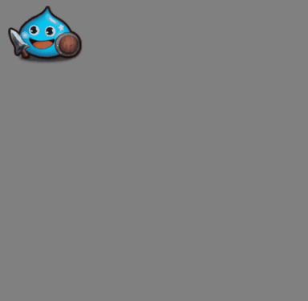
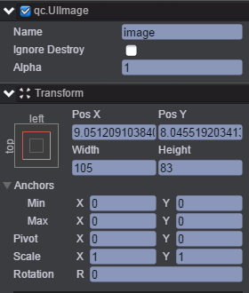
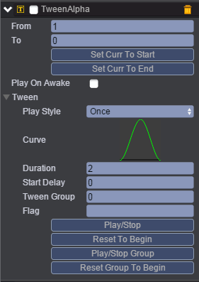
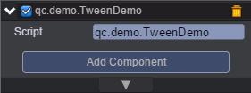

# Alpha
本范例演示Tween动画中的TweenAlpha（透明度动画），运行时，从透明度为1变化到0，再从0变为1，持续的时间是2秒，效果图如下：<br>


## UI
* 创建Image节点并取名image，节点信息设置如下图，需要把image节点的interactive勾选上，从而响应鼠标点击事件。<br>


* 在image节点下挂载TweenAlpha组件，如何挂载组件请查看Tween动画下的Tween演示，TweenAlpha组件挂载完成后如下图：<br>



* 属性具体信息请参考[<<编辑动画曲线>>](http://docs.zuoyouxi.com/manual/Tween/index.html)。<br>
* 在Scripts文件夹下创建脚本TweenDemo.js，将该脚本挂载到image节点上，如下图：<br>



* 代码如下：<br>

```javascript
var TweenDemo = qc.defineBehaviour('qc.demo.TweenDemo', qc.Behaviour, function() {
    this.counter = 0;
}, {
});

TweenDemo.prototype.onEnable = function() {
    var self = this;
    var ta = this.getScript('qc.TweenAlpha');
    ta.resetToBeginning();
    ta.onLoopFinished.add(self.onTweenEnd, self);
    ta.playForward();
};

//点击响应事件
TweenDemo.prototype.onClick = function() {
    
    var ta = this.getScript('qc.TweenAlpha');
    ta.stop();
};

TweenDemo.prototype.onTweenEnd = function() {
    this.counter++;
    console.log('counter', this.counter);
};   
```