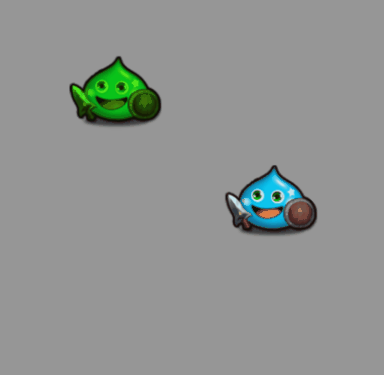
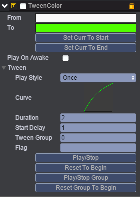
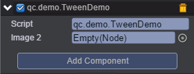
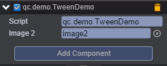

# Color
本范例演示Tween动画的TweenColor（颜色变换动画），运行时，先延迟1秒后，图片image开始TweenColor动画，时间为2秒，2秒结束后，图片image2接着开始TweenColor动画，效果图如下：<br>


## UI
* 创建两个Image并取名为image、image2。<br>
* 在image节点上挂载TweenColor组件，TweenColor组件挂载请参考Tween动画下的Tween演示，添加完组件TweenColor后显示如下图：<br>



* 属性具体信息请参考[<<编辑动画曲线>>](http://docs.zuoyouxi.com/manual/Tween/index.html)。<br>
* 在Scripts文件下创建脚本TweenDemo.js，并把该脚本挂载到image节点上，该脚本用于启动image的TweenColor动画，如下图：<br>


* 把image2节点拖入到image2选项方框中，通过代码设置image2节点的TweenColor动画参数，见下图：<br>



* 代码如下：<br>

```javascript
var TweenDemo = qc.defineBehaviour('qc.demo.TweenDemo', qc.Behaviour, function() {
    this.image2 = null;
}, {
    image2: qc.Serializer.NODE
});

TweenDemo.prototype.onEnable = function() {
    var self = this;
    var tc = this.getScript('qc.TweenColor');
    tc.resetToBeginning();
    tc.onFinished.addOnce(self.onTweenEnd, self);
    tc.playForward();
};

//image2开始播放动画
TweenDemo.prototype.onTweenEnd = function() {
    
    var tc = this.image2.addScript('qc.TweenColor');
    tc.from = qc.Color.black;
    tc.to = qc.Color.blue;
    tc.duration = 2;
    tc.resetToBeginning();
    tc.playForward();
};    
```