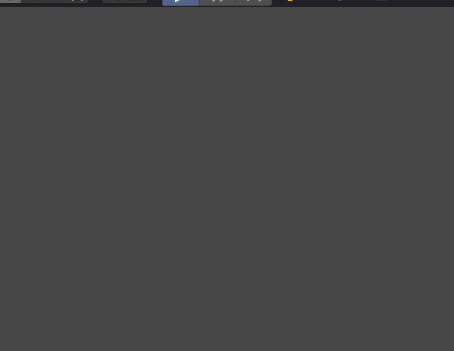
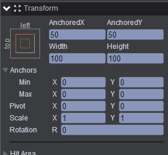
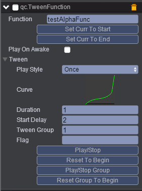
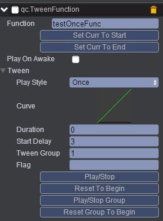
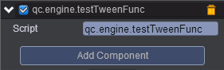

#  TweenFuction   
* 本范例介绍TweenFunction组件的使用，运行时，通过添加TweenFunction插件，从而同时可以实现多个Tween动画，效果图如下：<br>    
  
     

## UI    

* 在UIRoot节点下创建一个Image节点取名UIImage，该节点属性值设置如下：<br>    
    

* 在UIImage节点下创建一个Text节点取名UIText，将该节点显示勾去除掉，如下如：<br>    
     

* 在UIImage节点上挂载TweenFunction插件，请参考手册[手册](http://docs.zuoyouxi.com/manual/Tween/index.html)，挂载完插件后如下图：<br>     
* Function: testAlphaFunc <br>     
    
 

* 具体的属性信息，请查阅文档：[手册](http://docs.zuoyouxi.com/manual/Tween/index.html)。<br>       

* Function: testOnceFunc <br>    

      

* 在Scripts文件夹下创建脚本testTweenFunc.js，把该脚本挂载到UIImage节点上，如下图：<br>    
      
   

* 代码如下：<br>    

```javascript    

var testTweenFunc = qc.defineBehaviour('qc.engine.testTweenFunc', qc.Behaviour, function() {
    this.gameObject.alpha = 0;
    this.toPos = new qc.Point(50, 50);
}, {
});

//初始化
testTweenFunc.prototype.awake = function() {
	var tween = this.gameObject.getScript('qc.TweenFunction');
    
	//开始播放
    tween.resetGroupToBeginning();
    tween.playGroupForward(); 


};

// duration > 0
testTweenFunc.prototype.testAlphaFunc = function(factor, duration) {

	// 设置透明度
    this.gameObject.alpha = factor;
    
    //设置位置
    this.gameObject.x = this.toPos.x * factor;
    this.gameObject.y = this.toPos.y * factor;
};

// duration == 0
testTweenFunc.prototype.testOnceFunc = function(factor, duration) {
	var text = this.gameObject.find('UIText');
    text.visible = true;
};     
```
     

