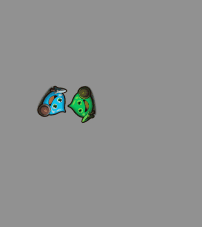
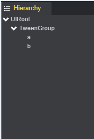
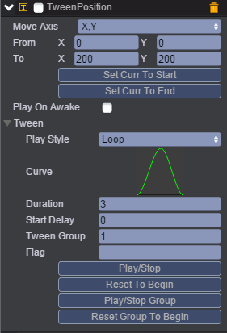
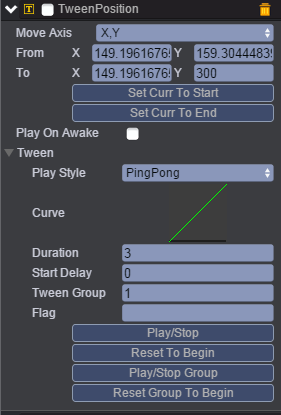
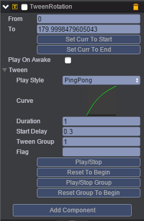
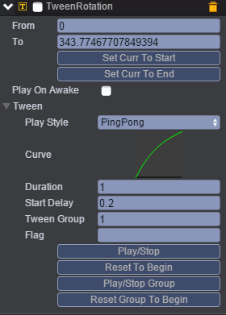
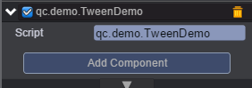

# Group
本范例演示当一个节点及其子节点，如果都挂载了同一个编组的Tween，只需要播放父亲节点的某个Tween，其他组件会自动启动播放。效果图如下：<br>


## UI
* 创建一个Empty Node节点并命名为TweenGroup。<br>
* 创建两个Image节点，取名为a，b并挂载到TweenGroup节点下，见下图:<br>


* 在TweenGroup节点下挂载TweenPosition组件，挂载TweenPosition组件请参考Tween动画下的Tween演示，挂载组件完成后如下图：<br>



* 属性具体信息请参考[<<编辑动画曲线>>](http://docs.zuoyouxi.com/manual/Tween/index.html)。<br>
* 同样在a节点下挂载TweenPosition及TweenRotation两个组件，如下图：<br>

* TweenPosition:<br>



* 上面的参数表示：Play Style设置为PingPong(即来回播放)，TweenGroup的值同样设置为1。<br>

* TweenRotation：<br>



* 上面的参数表示：旋转角度从From到To，延迟0.3秒开始播放TweenRotation，TweenGroup的值也设置为1。<br>
* 将TweenColor与TweenRotation组件挂载到b节点上，如下图：<br>

* TweenColor:<br>


* TweenRotation:<br>


* 在Scripts文件夹下创建脚本TweenDemo.js，并把该脚本挂载到TweenGroup节点下，该脚本用于启动成组播放动画，见下图：<br>



* 代码如下：<br>

```javascript
var TweenDemo = qc.defineBehaviour('qc.demo.TweenDemo', qc.Behaviour, function() {
}, {
});

TweenDemo.prototype.onEnable = function() {
    var self = this;
    var tp = this.getScript('qc.TweenPosition');
    tp.resetGroupToBeginning();
    tp.playGroupForward();
};   
```

