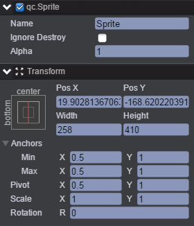
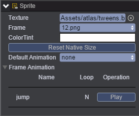
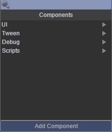
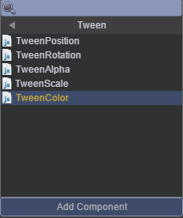
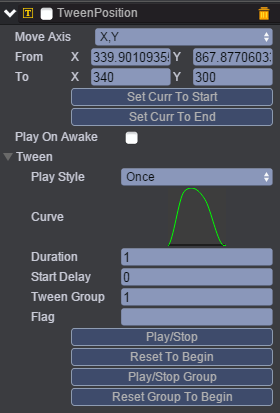
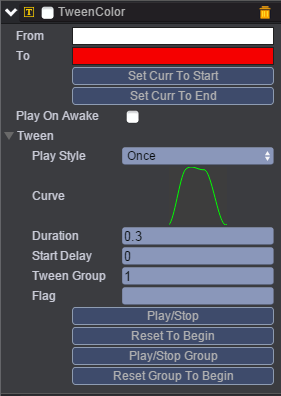
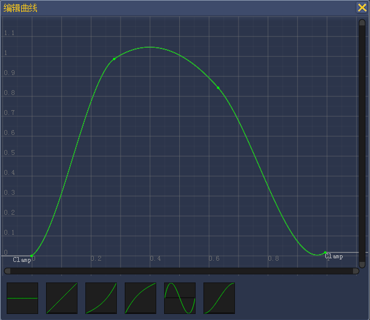
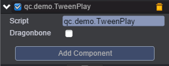

# TweenMixed
* 本范例演示Tween动画的TweenPosition（位移曲线）、TweenColor（颜色曲线），通过设置TweenPosition、TweenColor的参数可以在一定的时间范围内改变精灵位置及精灵的颜色，效果图如下：<br>    

    

## UI    

* 创建Sprite节点及节点信息设置如下图所示：<br>    

     

* 为该Sprite节点添加帧动画，见下图，编辑帧动画请参考[<<编辑帧动画>>](http://docs.zuoyouxi.com/manual/FrameAnimation/index.html)。<br>      

    

* 在Sprite节点下挂载TweenPosition及TweenColor组件，以添加TweenPosition组件为例，步骤是首先点击Inspector面板的Add Componnent按钮，此时出现如下界面：<br>     

   

* 然后再点击Tween，进入如下界面：<br>      

    

* 点击TweenPosition则添加组件完成，添加TweenColor组件与添加TweenPosition组件方法类似，下图为添加完成的TweenPositon组件与TweenColor组件及设置参数。<br>       

* TweenPosition: <br>    




* TweenColor:  <br> 

             

* 上面的参数表示：变化从From到To。播放类型为一次，Duration为从开始播放到结束持续的时间，将TweenPosition的Tween Group与TweenColor的TweenGroup都设为1，表示同组一起播放动画。Curse为动画播放曲线，以TweenPosition曲线为例，点击TweenPosition曲线，进入编辑曲线界面如下图，曲线编辑请参考[<<编辑动画曲线>>](http://docs.zuoyouxi.com/manual/Tween/index.html)：<br>      

     

* 上述曲线参数表示：横坐标为时间轴，表示从开始(0)到结束(1)，纵坐标为值，0为From，1为To，通过双击可以定义Key，并可以拖拽。<br>

* 在Scripts文件夹下创建脚本TweenPlay.js，并将该脚本挂载到Sprite节点上，该脚本负责启动播放动画逻辑，见代码注释，如下图：<br>   



* 代码如下：<br>   


```javascript
/**
 * 曲线动作演示播放
 */
var TweenPlay = qc.defineBehaviour('qc.demo.TweenPlay', qc.Behaviour, function() {
    this.dragonbone = false;
}, {
    // 需要序列化的字段
    dragonbone: qc.Serializer.BOOLEAN
});

TweenPlay.prototype.onEnable = function() {
    // 定期播放动作
    if (this.game.device.editor) return;
    var self = this;
    this.game.timer.loop(4000, function() {
        if (!self.dragonbone) self.play();
        else {
            self.playRandom();
        }
    });
};

// 开始播放
TweenPlay.prototype.play = function() {
    var self = this,
        tp = self.getScript('qc.TweenPosition'),
        ta = self.getScript('qc.TweenAlpha');

    // 播放动作
    self.gameObject.playAnimation('jump');
    tp.resetGroupToBeginning();
    tp.playGroupForward();
};

// 被点击时播放下
TweenPlay.prototype.onClick = function() {
    if (!this.dragonbone)
        this.play();
    else
        this.playRandom();
};

// 随机播放动作
TweenPlay.prototype.playRandom = function() {
    var self = this;
    var list = this.gameObject.animationNameList;
    var index = this.game.math.random(0, list.length - 1);
    this.gameObject.playAnimation(list[index], 1, false);
    this.gameObject.onFinished.addOnce(function() {
        self.gameObject.playAnimation('idle', 1, true);
    });
};     
```
