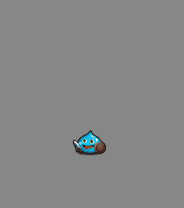
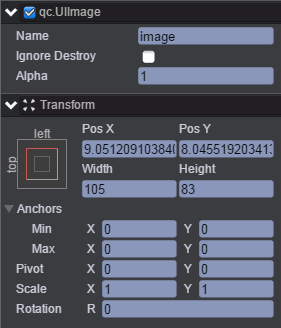
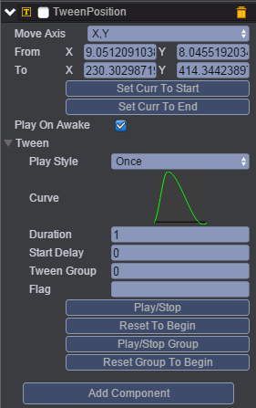
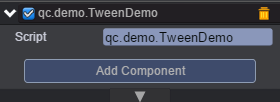

# Position
本范例演示Tween动画的TweenPosition（位移曲线），运行时，图片image节点从A点移动到B点再返回到A点，效果图如下：<br>


## UI
* 创建一个Image节点并命名为image，节点信息设置如下图：<br>


* 在image节点上挂载TweenPosition组件，挂载TweenPosition组件请参考Tween动画下的Tween演示，挂载完成后如下图：<br>



* 属性具体信息请参考[<<编辑动画曲线>>](http://docs.zuoyouxi.com/manual/Tween/index.html)。<br>
* 在Scripts文件夹下创建脚本TweenDemo.js，并将该脚本挂载到image节点上，该脚本负责启动播放Tween动画，如下图所示：<br>



* 代码如下：<br>

```javascript
var TweenDemo = qc.defineBehaviour('qc.demo.TweenDemo', qc.Behaviour, function() {
}, {
});

TweenDemo.prototype.onEnable = function() {
    var self = this;
    var tp = this.getScript('qc.TweenPosition');
    tp.resetToBeginning();
    tp.onFinished.addOnce(self.onTweenEnd, self);
    tp.playForward();
};

//播放动画
TweenDemo.prototype.onTweenEnd = function() {
    var self = this,
        tp = self.getScript('qc.TweenPosition');
    tp.playReverse();
    tp.onFinished.addOnce(function() {
        console.log('End.');
    });

};    
```