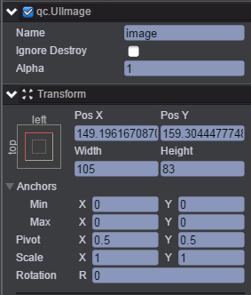
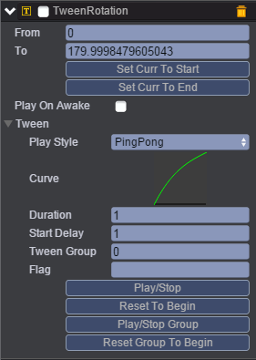
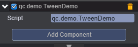

# Rotation
本范例演示TWeen动画的TweenRotation（旋转动画），运行时，图片image节点会自动旋转至我们设置的角度，效果图如下：<br>


## UI
* 创建Image节点并取名image，节点信息设置如下图：<br>


* 在image节点下挂载TweenRotation动画，挂载TweenRotation组件请参考Tween动画下的Tween演示，挂载完成后如下图：<br>



* 属性具体信息请参考[<<编辑动画曲线>>](http://docs.zuoyouxi.com/manual/Tween/index.html)。<br>
* 在Scripts文件下创建脚本TweenDemo.js，并把脚本挂载到image节点上，该脚本负责启动动画，如下图:<br>



* 代码如下：<br>

```javascript
var TweenDemo = qc.defineBehaviour('qc.demo.TweenDemo', qc.Behaviour, function() {
}, {
});

TweenDemo.prototype.onEnable = function() {
    var self = this;
    var tc = this.getScript('qc.TweenRotation');
    tc.resetToBeginning();
    tc.playForward();
};    
```