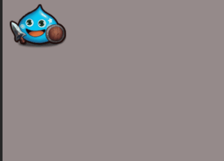
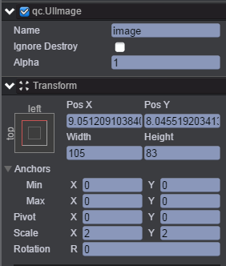
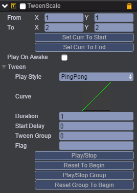
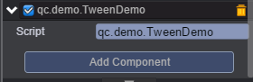

# Scale
本范例演示Tween动画的TweenScale（比例动画），运行时，图片image节点可以放大或者缩小到我们设置的倍数，效果图如下：<br>


## UI
* 创建Image节点并命名image，image节点信息设置如下图：<br>


* 在image节点下挂载TweenScale组件，挂载TweenScale组件可参考Tween动画下的Tween演示，挂载组件完成后如下图：<br>



* 属性具体信息请参考[<<编辑动画曲线>>](http://docs.zuoyouxi.com/manual/Tween/index.html)。<br>
* 在Scripts文件夹下创建脚本TweenDemo.js，并把该脚本挂载到image节点，该脚本负责启动动画并会在控制台输出相关信息，如下图：<br>



* 代码如下：<br>

```javascript
var TweenDemo = qc.defineBehaviour('qc.demo.TweenDemo', qc.Behaviour, function() {
    this.counter = 0;
}, {
});

TweenDemo.prototype.onEnable = function() {
    var self = this;
    var ts = this.getScript('qc.TweenScale');
    ts.resetToBeginning();
    ts.onFinished.addOnce(function() {
        console.log('End');
    });
    ts.onStart.add(function() {
        console.log('Start');
    });
    ts.playForward();
};

//鼠标点击事件
TweenDemo.prototype.onClick = function() {
    var ts = this.getScript('qc.TweenScale');
    if (ts.enable)
        ts.stop();
    else {
        ts.resetToBeginning();
        ts.playForward();
    }
};    
```

