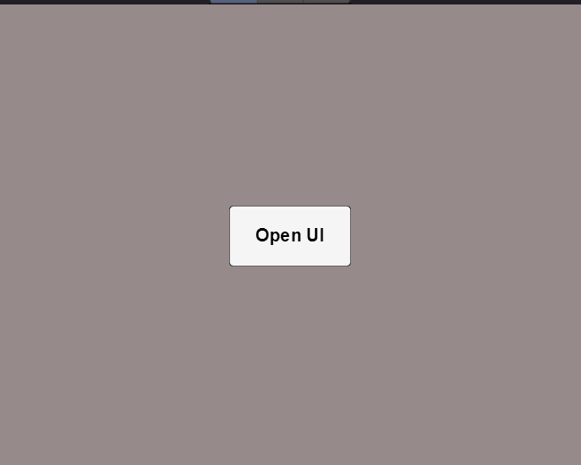
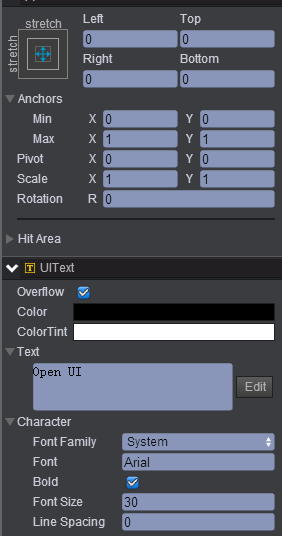
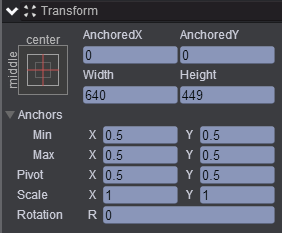
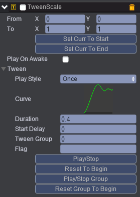
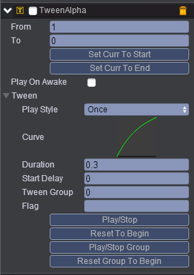
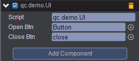

# uiOpenClose   
* 本范例介绍使用Tween组件实现界面打开和关闭的效果，运行时，点击按钮，将会打开一个界面，效果图如下：<br>     
       

## UI   

* 在UIRoot下创建一个Button按钮节点，按钮节点下的子节点Text属性值设置如下：<br>    
      

* 在UIRoot下创建一个Empty Node节点取名ui，ui节点的属性值设置如下：<br>      
        

* 在ui节点下分别创建三个Image节点，分别取名border、background、close，用于放置背景图片及关闭图片。<br>                
 
* 在ui节点下分别创建三个Sprite节点，全部取名为people，用于放置人物。<br>          

* 将TweenScale与TweenAlpha组件挂载到ui节点上，挂载Tween动画可参考[Tween手册](http://docs.zuoyouxi.com/manual/Tween/index.html)，挂载后的效果图如下：<br>     

* TweenScale: <br>         
        

*  TweenAlpha: <br>    
       

* 在Scripts文件夹下创建脚本 UI.js，把该脚本挂载到ui节点上，并把Button节点与close节点拖入到对应的属性，如下图：<br>      
     

*  代码如下：<br>      

```javascript     
var UI = qc.defineBehaviour('qc.demo.UI', qc.Behaviour, function() {
}, {
    openBtn: qc.Serializer.NODE,
    closeBtn: qc.Serializer.NODE
});

//初始化
UI.prototype.awake = function() {
    var self = this;
	
	//添加监听
    this.addListener(self.openBtn.onClick, self.open, self);
    this.addListener(self.closeBtn.onClick, self.close, self);
};

//打开界面
UI.prototype.open = function() {
    var ts = this.getScript('qc.TweenScale');
    var self = this,
        o = self.gameObject;
    
    o.visible = true;
    o.alpha = 1;
    ts.resetToBeginning();
    ts.playForward();
};

//关闭界面
UI.prototype.close = function() {
    var ta = this.getScript('qc.TweenAlpha');
    var self = this,
        o = self.gameObject;
    
    ta.resetToBeginning();
    ta.onFinished.addOnce(function() {
        o.visible = false;
    });
    ta.playForward();
};      
``` 
