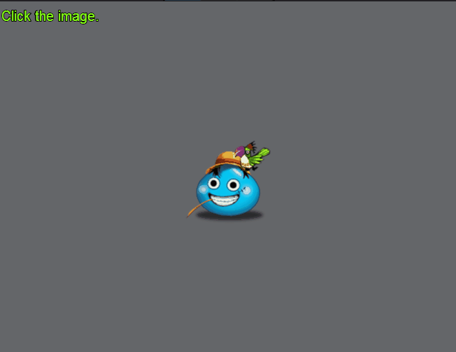
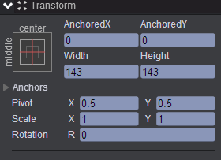
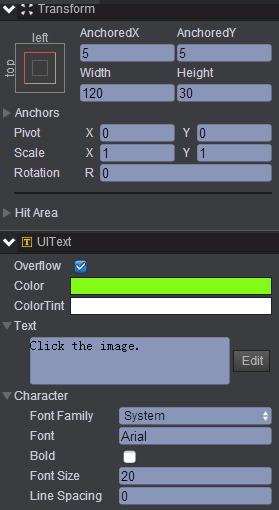
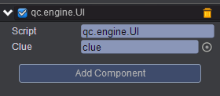

#  changeAlpha    
* 本范例演示点击图片改变图片的透明度，效果图如下：<br>   
   

## UI   
* 在UIRoot节点下创建一个Image节点取名center，该节点的属性值设置如下：<br>  
    

* 在UIRoot节点下创建一个Text节点取名clue，该节点的属性值设置如下：<br>   
     

* 在Scripts文件夹下创建脚本 UI.js，把该脚本挂载到center节点，如下图：<br>   
     

* 代码如下：<br>    

```javascript  

var UI = qc.defineBehaviour('qc.engine.UI', qc.Behaviour, function() {
}, {
    clue: qc.Serializer.NODE
});

UI.prototype.onClick = function() {
    // 改变透明度
    this.gameObject.alpha = Math.random();
};   
```