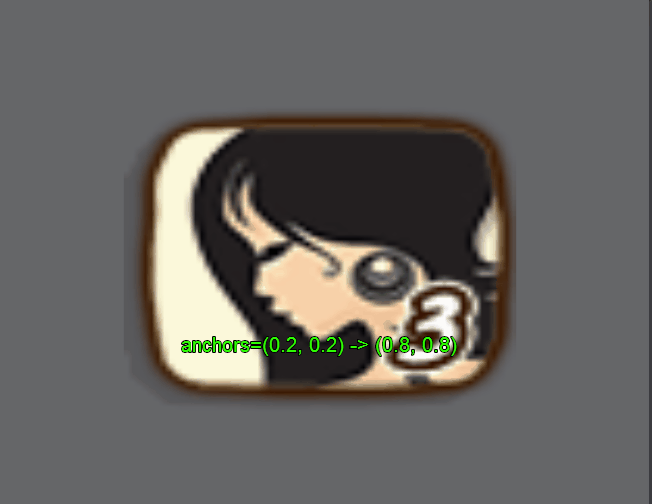
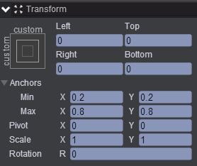
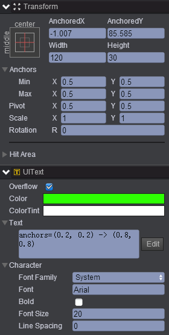
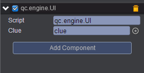

#  changeAnchor    
* 本范例介绍使用setAnchor方法改变图片锚点后的效果，效果图如下：<br>   
   

## UI   
* 在UIRoot节点下创建一个Image节点取名center，该节点的属性值设置如下：<br>  
    

* 在UIRoot节点下创建一个Text节点取名clue，该节点的属性值设置如下：<br>   
     

* 在Scripts文件夹下创建脚本 UI.js，把该脚本挂载到center节点，如下图：<br>   
     

* 代码如下：<br>    

```javascript   

var UI = qc.defineBehaviour('qc.engine.UI', qc.Behaviour, function() {
}, {
    clue: qc.Serializer.NODE
});

//点击响应
UI.prototype.onClick = function() {
    var math = this.game.math,
        o = this.gameObject;
    var minX = math.random(0, 5)/10,
        minY = math.random(0, 5)/10,
        maxX = math.random(6, 10)/10,
        maxY = math.random(6, 10)/10;
    o.setAnchor(new qc.Point(minX, minY), new qc.Point(maxX, maxY), false);
    o.cleft = o.right = o.top = o.bottom = 0;
    
    this.clue.text = 'anchors=(' + minX + ', ' + minY + ') -> (' + maxX + ', ' + maxY + ')'; 
};     
```