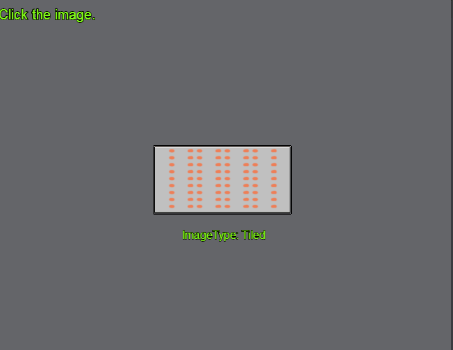
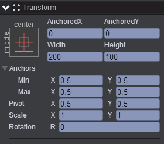
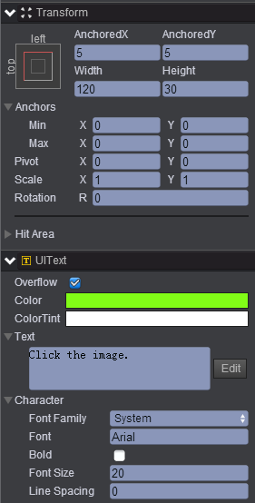
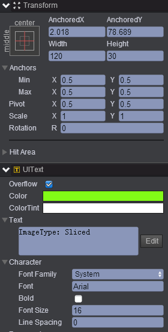
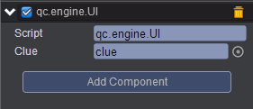

# changeImagetype   
* 本范例介绍动态修改图片的imageType属性的显示效果，效果图如下：<br>     
    

## UI   
* 在UIRoot下创建Image节点取名center，该节点的属性值设置如下：<br>   
    

* 在UIRoot下创建Text节点取名title，该节点的属性值设置如下：<br>   
     

* 在UIRoot下创建Text节点取名clue，该节点的属性值设置如下：<br>   
     

* 在Scripts文件夹下创建脚本 UI.js，把该脚本挂载到center节点，如下图：<br>     
    

* 代码如下：<br>     

```javascript     

var UI = qc.defineBehaviour('qc.engine.UI', qc.Behaviour, function() {
}, {
    clue: qc.Serializer.NODE
});

//响应点击
UI.prototype.onClick = function() {
    var types = {
       Simple: qc.UIImage.IMAGE_TYPE_SIMPLE,
       Sliced: qc.UIImage.IMAGE_TYPE_SLICED,
       Tiled: qc.UIImage.IMAGE_TYPE_TILED
    };
    var r = this.game.math.random(0, 2);
    var type = 'Simple';
    if (r === 0) type = 'Sliced';
    else if (r === 1) type = 'Tiled';
    
    this.gameObject.imageType = types[type];
    this.clue.text = 'ImageType: ' + type;
};      
```