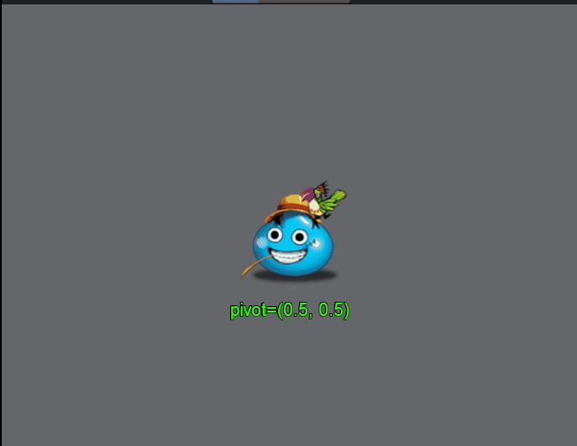
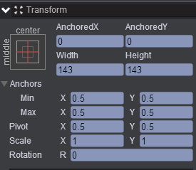
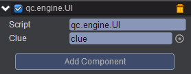

# changePivot    
* 本范例介绍动态修改图片的pivot属性的显示效果，效果图如下：<br>    
  

## UI   
* 在UIRoot节点下创建一个Image节点取名center，该节点的属性值设置如下：<br>  
    

* 在UIRoot节点下创建一个Text节点取名clue，该节点的属性值设置如下：<br>   
     

* 在Scripts文件夹下创建脚本 UI.js，把该脚本挂载到center节点，如下图：<br>   
     

* 代码如下：<br>    

```javascript   

var UI = qc.defineBehaviour('qc.engine.UI', qc.Behaviour, function() {
}, {
    clue: qc.Serializer.NODE
});

//响应点击
UI.prototype.onClick = function() {
    this.gameObject.pivotX = Math.random(0, 1).toFixed(2);
    this.gameObject.pivotY = Math.random(0, 1).toFixed(2);
    
    this.clue.text = 'pivot=(' + this.gameObject.pivotX + ', ' + this.gameObject.pivotY + ')';
};  
```