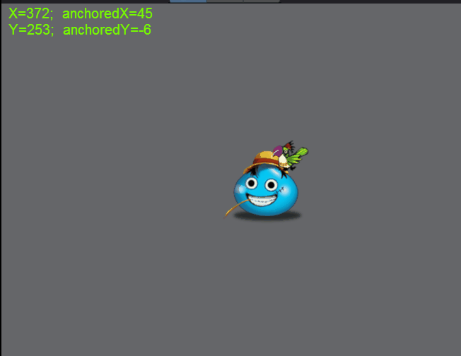
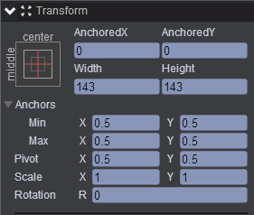
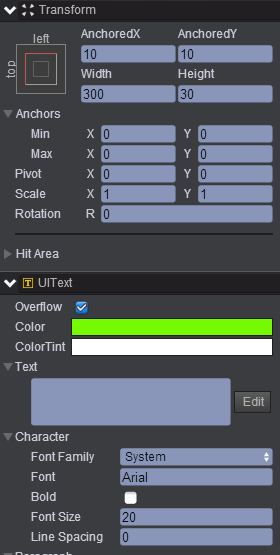
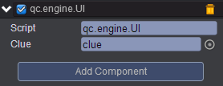

# changePosition  
* 本范例介绍动态修改图片的x、y属性的显示效果，效果图如下：<br>    
  

## UI   
* 在UIRoot节点下创建一个Image节点取名UIImage，该节点的属性值设置如下：<br>  
    

* 在UIRoot节点下创建一个Text节点取名clue，该节点的属性值设置如下：<br>   
     

* 在Scripts文件夹下创建脚本 UI.js，把该脚本挂载到UIImage节点，如下图：<br>   
     

* 代码如下：<br>    

```javascript   

var UI = qc.defineBehaviour('qc.engine.UI', qc.Behaviour, function() {
}, {
    clue: qc.Serializer.NODE
});

//帧调度
UI.prototype.update = function() {
    var math = this.game.math;
    this.gameObject.x += math.random(-5, 5);
    this.gameObject.y += math.random(-5, 5);
    
    this.clue.text = 'X=' + this.gameObject.x + ';  anchoredX=' + this.gameObject.anchoredX +
        '\nY=' + this.gameObject.y + ';  anchoredY=' + this.gameObject.anchoredY;
};  
```