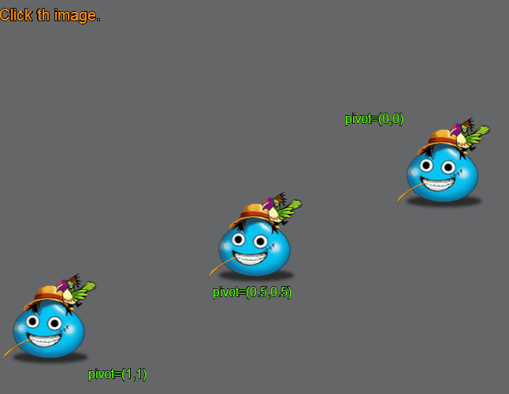
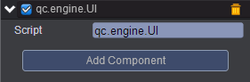

# changeScale   

* 本范例介绍不同pivot的图片的放大效果，效果图如下：<br>     
    
  

## UI   
* 在UIRoot节点下创建三个Image节点，分别取名center、right-top、left-bottom。用于放置图片。<br>    
     
* 在UIRoot节点下创建三个Text节点分别取名center-pivot、right-top-pivot、left-bottom-pivot，这三个文本节点用于显示每个节点的pivot信息，<br>     
 
* 在UIRoot节点下创建一个Text节点，该节点的text设置为Click the image，用于提示点击图片。<br>     

* 在Scripts文件夹下创建脚本 UI.js，center节点、right-top节点、left-bottom节点都挂载该脚本。如下图：<br>    
  
         

* 代码如下：<br>    

```javascript   

var UI = qc.defineBehaviour('qc.engine.UI', qc.Behaviour, function() {
}, {
});

//点击响应
UI.prototype.onClick = function() {
    var math = this.game.math;
    this.gameObject.scaleX = math.random(3, 30)/10;
    this.gameObject.scaleY = math.random(3, 30)/10;
};     
```