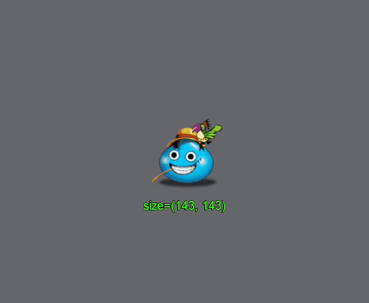
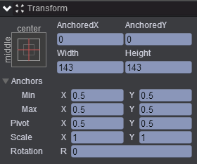
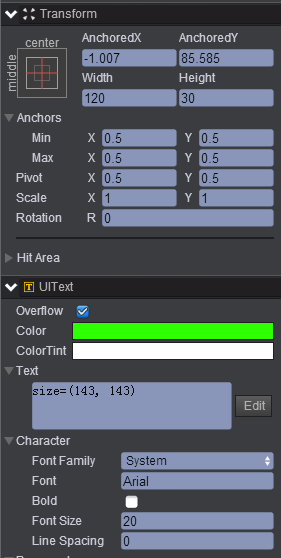
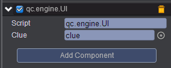

# changeSize 
* 本范例介绍动态修改图片宽高的效果，效果图如下：<br>    
  

## UI   
* 在UIRoot节点下创建一个Image节点取名UIImage，该节点的属性值设置如下：<br>  
    

* 在UIRoot节点下创建一个Text节点取名clue，该节点的属性值设置如下：<br>   
     

* 在Scripts文件夹下创建脚本 UI.js，把该脚本挂载到UIImage节点，如下图：<br>   
     

* 代码如下：<br>    

```javascript   

var UI = qc.defineBehaviour('qc.engine.UI', qc.Behaviour, function() {
}, {
    clue: qc.Serializer.NODE
});

//点击响应
UI.prototype.onClick = function() {
    var math = this.game.math;
    this.gameObject.width = math.random(30, 200);
    this.gameObject.height = math.random(30, 200);
    
    this.clue.text = 'Size=(' + this.gameObject.width + ', ' + this.gameObject.height + ')';
};  
```