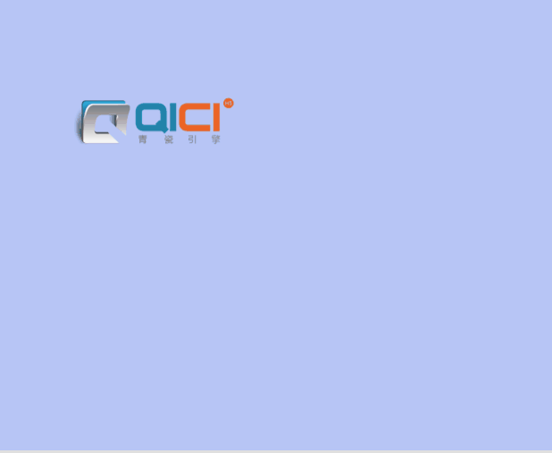
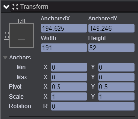
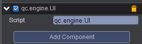

# imageMove
* 本范例演示对图片进行拖动，效果图如下：<br>    
  

## UI   
* 在UIRoot节点下创建一个Image节点取名UIImage，该节点的属性值设置如下：<br>  
    

* 在Scripts文件夹下创建脚本 UI.js，把该脚本挂载到UIImage节点，如下图：<br>   
     

* 代码如下：<br>    

```javascript   

var UI = qc.defineBehaviour('qc.engine.UI', qc.Behaviour, function() {
}, {
});

UI.prototype.awake = function() {
    this.addListener(this.game.input.onPointerMove, this.onPointerMove, this);
};

//移动图片
UI.prototype.onPointerMove = function(id, x, y) {
    this.gameObject.x = x;
    this.gameObject.y = y;
};      
```