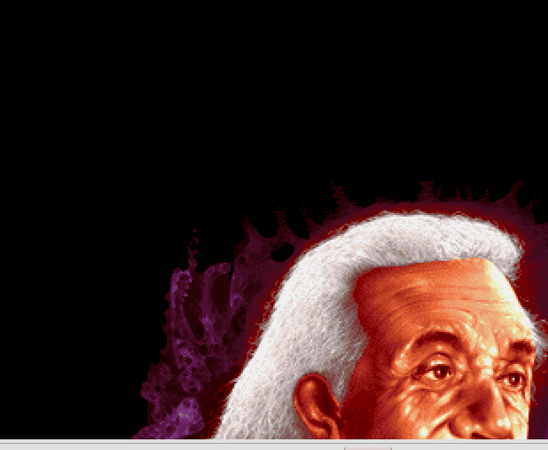
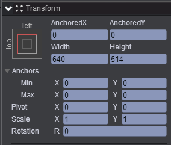
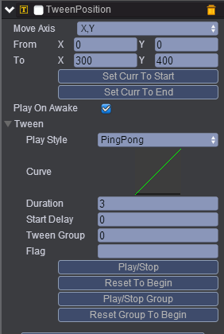

# moveAnImage
* 本范例演示UIImage节点挂载TweenPosition组件移动的效果，效果图如下：     
  

## UI   
* 在UIRoot节点下创建一个Image节点取名UIImage，该节点的属性值设置如下：   
    

* 在UIImage节点下挂载TweenPosition组件，Tween动画可参考[Tween手册](http://docs.zuoyouxi.com/manual/Tween/index.html)，如下图：    
          
     
