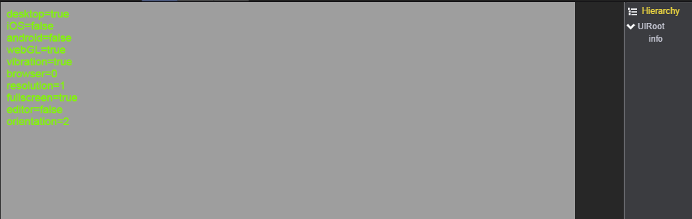

# 设备信息

* 本范例介绍如何获取设备信息。效果图如下：<br>
   

* 创建一个Text，用来显示设备信息。<br>     

* 创建脚本DeviceTest.js，负责获取设备信息内容，脚本挂在info节点上。<br>    

* 代码如下：<br>    

```javascript
var DeviceTest = qc.defineBehaviour('qc.demo.DeviceTest', qc.Behaviour, function() {
    this.runInEditor = true;
}, {
});

DeviceTest.prototype.awake = function() {
    var content = '', device = this.game.device;

    content += 'desktop=' + device.desktop;
    content += ' \niOS=' + device.iOS;
    content += ' \nandroid=' + device.android;
    content += ' \nwebGL=' + device.webGL;
    content += ' \nvibration=' + device.vibration;
    content += ' \nbrowser=' + device.browser;
    content += ' \nresolution=' + device.resolution;
    content += ' \nfullscreen=' + device.fullscreen;
    content += ' \neditor=' + device.editor;
    content += ' \norientation=' + device.orientation;
    this.gameObject.text = content;
};    
```