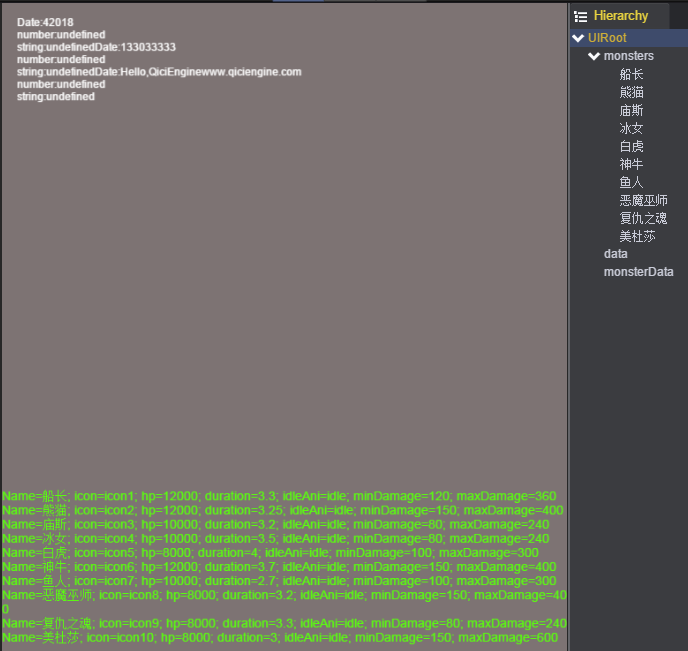
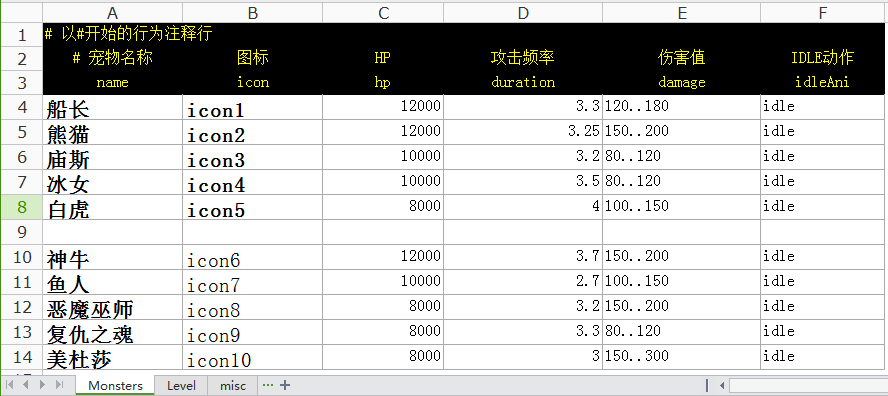
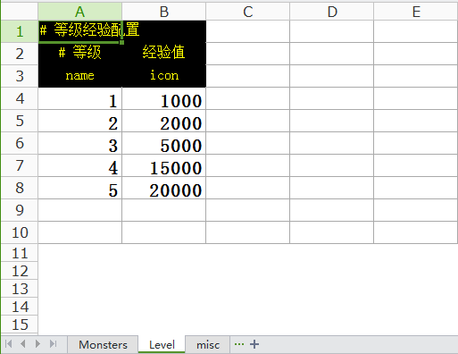
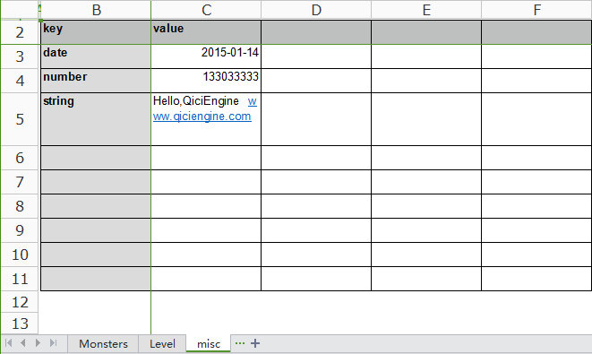
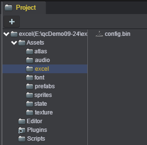
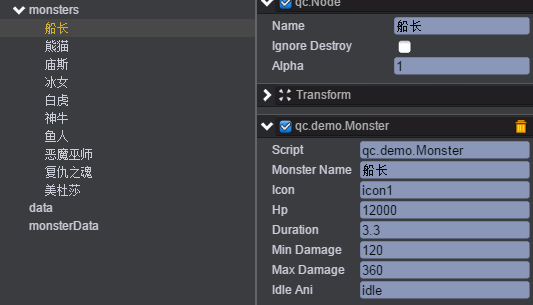
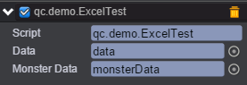

# Excel的使用

* 本范例演示从Excel表格中读取每行数据进行展示。效果图如下：<br>


## 使用Excel

* Excel表格数据对策划是非常友好的，而且是高度可定制化的。因此我们强烈建议广大开发者能够使用好这个工具，千万千万别把一堆游戏配置相关的数据写到代码中：提供一张excel表吧，让策划搞定。<br>   

### 支持的Excel数据格式

* 以'#'开头的为注释行，解析时会忽略掉<br>    
* 第一个非注释行、非空行为列的名称<br>    
* 后续为配置内容，支持公式运算<br>   
* 支持多个sheet<br>    

### 导入Excel文件

* 建立一个Excel文件：config.xlsx，里面包含了3个sheet，内容等如下图所示：<br>    

<br>    

<br>   

<br>   

* 直接将Excel表格(config.xlsx)拖入Project/Assets/excel/目录中，系统会自动生成config.bin格式的文件。如下图：<br>   

     

## UI

* 在新建场景中创建一个EmptyNode命名为monsters。作为新建节点的父亲节点。通过脚本Monster.js，读取Monster数据，每一条信息创建一个新的节点，并根据读取的信息设置到对应的属性上。如下图：<br>
    

* 在根节点下创建一个Text作为data，用来显示misc表格的数据信息。<br>     
* 在根节点下创建一个Text作为mosterData，用来显示Monsters表格的数据信息。<br>    
* 创建脚本ExcelTest.js，负责读取Excel表格中的数据，脚本挂在根节点下。如下图：<br>   
<br>

* ExcelTest.js脚本代码如下：<br>

```javascript
var ExcelTest = qc.defineBehaviour('qc.demo.ExcelTest', qc.Behaviour, function() {
    this.data = null;
    this.monsterData = null;
}, {
    data: qc.Serializer.NODE,
    monsterData: qc.Serializer.NODE
});

ExcelTest.prototype.awake = function() {
    var self = this;
    self.game.assets.load('config', 'Assets/excel/config.bin', function(data) {
        console.log('Excel file downloaded.', data);
        self.read();
    });
};

// 读取演示
ExcelTest.prototype.read = function() {
    // 获取下载的内容
    var data = this.game.assets.find('config');

    console.log('sheets列表', data.sheetsName);

    // key为sheets名称，value为数据表(类型qc.ExcelSheet)
    console.log('所有的数据', data.sheets);

    // 读取monsters表
    this.readMonsters(data.findSheet('Monsters'));

    // read sheet:misc
    this.readMisc(data.findSheet('misc'));
};

// 读取Monsters
ExcelTest.prototype.readMonsters = function(monsters) {
    var self = this;
    console.log('columns', monsters.columns);

    var content = '';
    monsters.rows.forEach(function(row) {
        var o = self.game.add.node(self.gameObject.find('monsters'));
        var monster = o.addScript('qc.demo.Monster');
        monster.set(row);
        monster.name = row.name;

        content += monster.toString();
    });
    this.monsterData.text = content;
};

// 读取misc
ExcelTest.prototype.readMisc = function(datas) {
    var content = '';

    datas.rows.forEach(function(row) {
        console.log(row);
        content += 'Date:' + row.value;
        content += '\nnumber:' + row.number;
        content += '\nstring:' + row.string;
    });
    this.data.text = content;
};     
```
