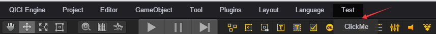
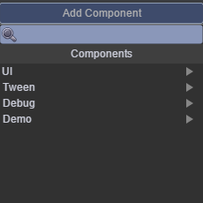

# 编辑器扩展

* 本范例演示扩展主菜单的功能。效果图如下：<br>   

    

* 在Project/Editor/目录下创建脚本ExtendEditor.js，实现菜单扩展的功能。<br>    

* 代码如下：<br>   

```javascript
// 菜单扩展
// 第一个参数指明主菜单的路径，使用/进行分割
// 第二个参数表示当菜单被点击时的处理逻辑，以下代码中弹出一个提示框
G.extend.menu('Test/ClickMe', function() {
    alert('Welcome!');
});

// 脚本显示扩展
// 第一个参数为自定义的脚本组件类名
// 第二个参数为重载的绘制函数
G.extend.inspector('qc.demo.Test', function() {
    var self = this,
        target = self.target;

    // 先调用默认的绘制方法
    self.defaultDraw();

    // 调用自己的绘制
    var gui = qc.editor.gui;
    gui.columnWidths = ["70+0.1", "60+0.5"];
    gui.line([
        gui.text('Test'),
        gui.text('Test Only')
    ]);
});
```

* 创建脚本Test.js。<br>
* 代码如下：<br>

```javascript
var Test = qc.defineBehaviour('qc.demo.Test', qc.Behaviour, function() {
}, {
	birthday: qc.Serializer.STRING
});

// 指定显示的菜单位置
Test.__menu = 'Demo/Test';
```

* 在场景中创建一个空节点node，将脚本添加到node节点上。点击AddComponent，如下图：<br>   

<br>    

可以看到原先目录名称为Script变成了Demo。


