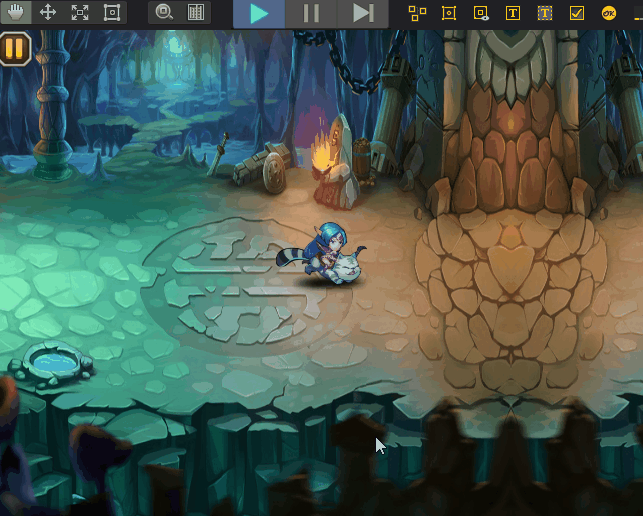
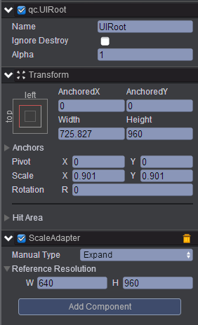
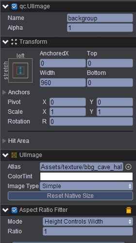
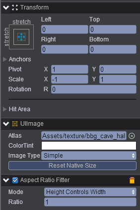
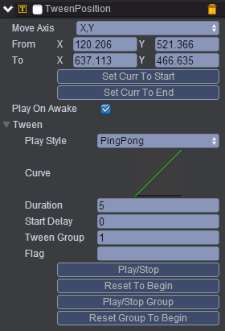
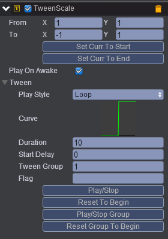
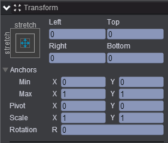
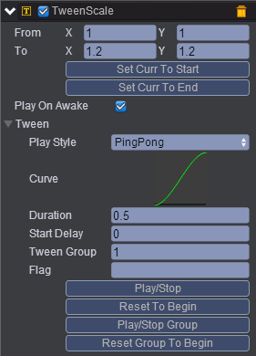
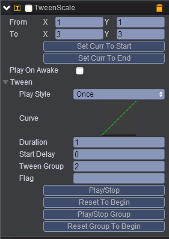
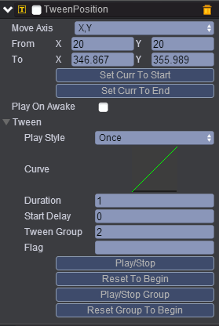

# gamePause(暂停游戏)

* 本范例介绍使用onNativeClick事件实现游戏暂停功能，效果图如下：<br>



## UI

* 首先创建一个UIRoot节点,UIRoot的属性值设置如下图所示：<br>    



* 在UIRoot节点下创建子节点Empty Node并取名为Game，在Game节点下创建子节点UIImage图片节点取名backgroup，并在backgroup节点下挂载Aspect Ratio Fitter组件，选择Mode为高控制宽，backgroup属性值设置如下所示：<br>  



* 在backgroup节点下再创建一个子节点UIImage，取名为backgroup，属性值设置如下图所示：<br>   



* 在Game节点下创建一个Sprite节点，取名为role，该节点为用于播放骨骼动画，在该节点上分别挂载TweenPosition动画与TweenScale动画，Tween动画挂载可参考[Tween](http://docs.zuoyouxi.com/manual/Tween/index.html)，role节点挂载的Tween动画如下所示：<br>  

* TweenPosition:<br>   

    

* TweenScale:<br>    

   

* 在UIRoot下创建子节点Empty Node并取名ui，设置该节点属性值如下图：<br>   

   

* 在ui节点下创建一个Button节点取名为pause，在该节点下挂载三个Tween动画，Tween详见[Tween](http://docs.zuoyouxi.com/manual/Tween/index.html)如下图所示：<br>   

* TweenScale:<br>   

    

* TweenScale:<br>   

   

   

* 在Scripts文件夹新建脚本，并把该脚本挂载到pause节点上。<br>    

* 代码如下：<br>  

```javascript

var GamePauseDemo = qc.defineBehaviour('qc.engine.GamePauseDemo', qc.Behaviour, function() {
    
    this.inPausing = false;
}, {
    // 序列化
});

// 初始化
GamePauseDemo.prototype.awake = function() {
    // 游戏暂停时，game逻辑中的update不会被调度，所以需要使用NativeClick进行操作
    this.addListener(this.gameObject.onNativeClick, this.gamePause, this);
};

GamePauseDemo.prototype.gamePause = function() {
    var self = this;
	
    // 暂停中不响应操作
    if (self.inPausing) {
        return;
    }
    self.inPausing = true;
	var position;
    if (self.game.paused) {
	
        // 必须先将游戏resume，才能正常播放动画效果
		self.game.paused = false;
        qc.Tween.stopGroup(self.gameObject, 1);
        qc.Tween.stopGroup(self.gameObject, 2);
        qc.Tween.resetGroupToBeginning(self.gameObject, 2, true);
		position = self.gameObject.getScript('qc.TweenPosition');
        if (position) {
            position.onFinished.removeAll(self);
            position.onFinished.addOnce(function() {
			
                // 需要强制更新下Button的nativeElement位置
                self.gameObject.update(true);
                self.inPausing = false;
				qc.Tween.stopGroup(self.gameObject, 1);
                qc.Tween.stopGroup(self.gameObject, 2);
                qc.Tween.resetGroupToBeginning(self.gameObject, 2);
                qc.Tween.resetGroupToBeginning(self.gameObject, 1);
                qc.Tween.playGroup(self.gameObject, 1);
            }, self);
        }
        qc.Tween.playGroup(self.gameObject, 2, true);
    }
    else {
        qc.Tween.stopGroup(self.gameObject, 1);
        qc.Tween.stopGroup(self.gameObject, 2);
        qc.Tween.resetGroupToBeginning(self.gameObject, 2);
		position = self.gameObject.getScript('qc.TweenPosition');
        if (position) {
			position.onFinished.removeAll(self);
            position.onFinished.addOnce(function() {
			
                // 需要强制更新下Button的nativeElement位置
                self.gameObject.update(true);
                self.inPausing = false;
				
                // 动画播放完成后才能暂停游戏，否则动画会无法播放出来
				self.game.paused = true;
            }, self);
        }
        qc.Tween.playGroup(self.gameObject, 2);
    }
};    
```