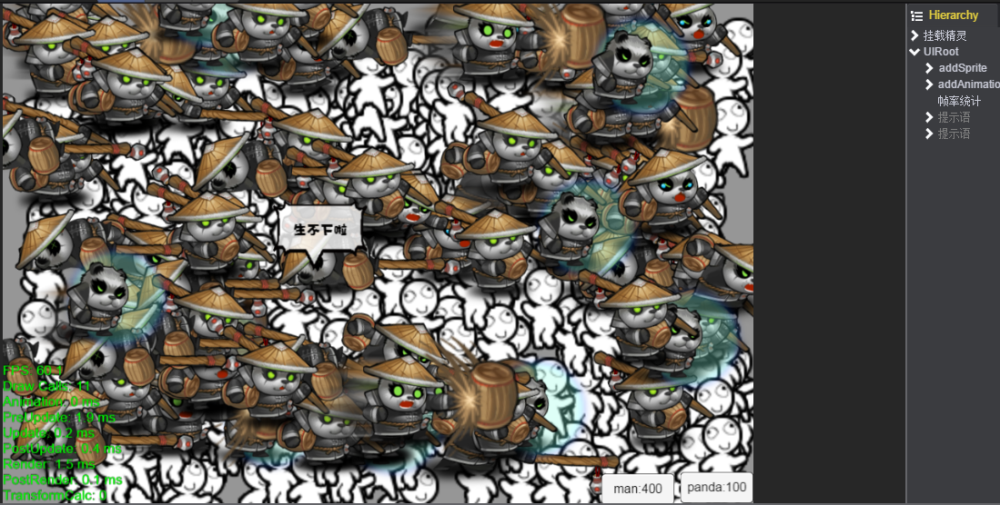
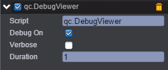
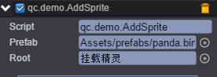
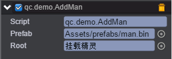

# 性能展示

* 本范例展示引擎的性能。效果图如下：<br>    



## UI

* 在新建场景中创建一个EmptyNode，命名为挂载精灵，作为后续动态添加精灵的父亲节点。<br>  

* 在根节点下创建一个Image作为提示语的背景图。在提示语的节点下添加一个Text，用来显示提示语的内容。<br>   

* 创建脚本ClueText.js，负责随机显示提示语内容和提示语节点的显示位置，脚本挂在提示语节点上。<br>    

* 代码如下：<br>   

```javascript
/**
 * 贱贱的提示语
 */
var ClueText = qc.defineBehaviour('qc.demo.ClueText', qc.Behaviour, function() {
    // 提示语内容
    this.clues = [
        '生不下啦',
        '空间不够\n啦！！！',
        '挤死我了',
        '不要再生\n啦！！！',
        '人口不够\n造房子！'
    ];
}, {
    // 需要序列化的字段
});

// 初始化处理
ClueText.prototype.awake = function() {
    this.redraw();
};

// 界面重绘，延迟显示出来
ClueText.prototype.redraw = function() {
    var self = this;
    self.game.timer.add(self.game.math.random(1000, 10000), function() {
        var index = self.game.math.random(0, self.clues.length - 1);
        self.gameObject.visible = true;
        self.gameObject.find('UIText').text = self.clues[index];

        // 设置位置
        var rect = self.gameObject.parent.rect;
        self.gameObject.x = self.game.math.random(80, rect.width - 80);
        self.gameObject.y = self.game.math.random(60, rect.height - 100);

        // 延迟3s关闭
        self.game.timer.add(3000, function() {
            self.redraw();
        });
    });

    self.gameObject.visible = false;
};
```
* 复制提示语，用来显示第二个提示语。<br>   

* 在根节点下创建一个Text，在此节点上添加一个DebugViewer组件，用来显示帧率统计。如下图：<br>  

   

* 在根节点下创建一个Button作为addSprite，点击按钮触发添加精灵事件。<br>   

* 创建脚本AddSprite.js，负责添加精灵的逻辑，并显示当前精灵个数，脚本挂载addSprite节点上。如下图：<br>  

   

* 代码如下：<br>   

```javascript
/**
 * 添加一个精灵
 */
var AddSprite = qc.defineBehaviour('qc.demo.AddSprite', qc.Behaviour, function() {
    // 添加的精灵预制
    this.prefab = null;

    // 挂载的父亲节点
    this.root = null;
    this.count = 0;
}, {
    // 需要序列化的字段
    prefab: qc.Serializer.PREFAB,
    root: qc.Serializer.NODE
});

// 初始化处理，一开始就扔100个动画进来
AddSprite.prototype.onEnable = function() {
    var total = 2;
    if (this.game.device.webGL) total = 100;
    for (var i = 0; i < total; i++) this.onClick();
};

// 界面被点击的处理
AddSprite.prototype.onClick = function() {
    var sprite = this.game.add.clone(this.prefab, this.root);

    // 随机扔个位置
    sprite.x = this.game.math.random(30, this.game.world.width - 30);
    sprite.y = this.game.math.random(30, this.game.world.height - 30);

    // 随机播放动作
    var animations = sprite.animationNameList;
    var index = this.game.math.random(0, animations.length - 1);
    sprite.playAnimation(animations[index], 1, true);

    // 显示数量
    this.gameObject.text.text = 'panda:' + (++this.count);
};
```

* 在根节点下创建一个Button作为addAnimation，点击按钮触发添加帧动画事件。<br>  

* 创建脚本AddMan.js，负责添加帧动画的逻辑，并显示当前帧动画个数，脚本挂载addAnimation节点上。如下图：<br>   

   

* 代码如下：<br>   

```javascript
/**
 * 添加一个帧动画
 */
var AddMan = qc.defineBehaviour('qc.demo.AddMan', qc.Behaviour, function() {
    // 添加的精灵预制
    this.prefab = null;

    // 挂载的父亲节点
    this.root = null;
    this.count = 0;
}, {
    // 需要序列化的字段
    prefab: qc.Serializer.PREFAB,
    root: qc.Serializer.NODE
});

// 初始化处理，一开始就扔400个帧动画进来
AddMan.prototype.awake = function() {
    var total = 20;
    if (this.game.device.webGL) total = 200;
    for (var i = 0; i < total; i++) this.onClick();
};

// 界面被点击的处理
AddMan.prototype.onClick = function() {
    // 每次扔2个进来
    for (var i = 0; i < 2; i++) {
        var sprite = this.game.add.clone(this.prefab, this.root);

        // 随机扔个位置
        sprite.x = this.game.math.random(0, this.game.world.width - 60);
        sprite.y = this.game.math.random(0, this.game.world.height - 60);

        // 随机播放动作
        var animations = sprite.animationNameList;
        var index = this.game.math.random(0, animations.length - 1);
        sprite.playAnimation(animations[index], 1, true);

        // 显示数量
        this.gameObject.text.text = 'man:' + (++this.count);
    }
};     
```