# 内置组件

* 本范例是介绍QC引擎内置组件：Button、Toggle、ProgressBar、Slider、InputField、Sound、ScrollView、ScrollBar、Sprite。如下图： 
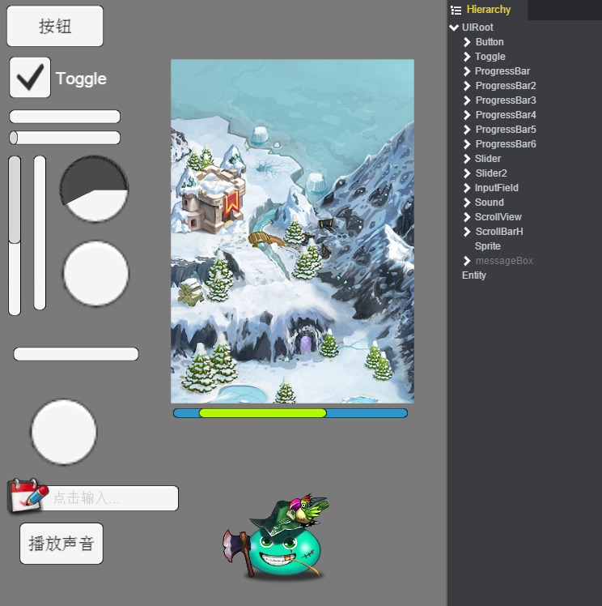

## 创建组件

* 在新建场景Hierarchy面板右击，选择“Create”会出现组件列表，选择要创建的组件。如下图： 
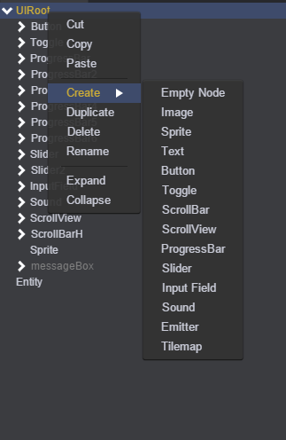

## Button

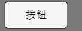   

* 按钮：点击的事件处理。 

## Toggle

  

* 开关功能。   

## ProgressBar

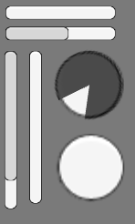
* 进度条分为三种显示类型：水平进度条、垂直进度条和圆形进度条。可以通过ProgressBar的Style的属性进行选择设置。如下图： 
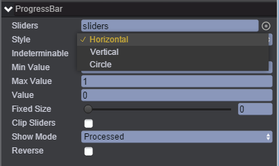   

* 每种进度条的类型又分为两种方式：确定进度和不确定进度。可以通过设置ProgressBar的Indeterminable的属性。Indeterminable属性打钩是不确定进度，当前进度值Value是一直在(MinValue,MaxValue)间变化。如下图： 

## Slider

* 拉条分为三种显示类型：水平拉条、垂直拉条和圆形拉条。可以通过Slider的Style属性进行选择设置。如下图： 
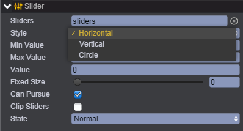

## InputField

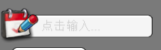
* 输入框。 
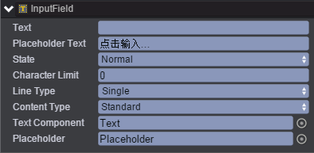 

## Sound

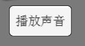
* 声音，用来播放指定的声音。 
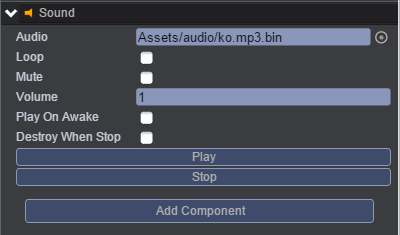 

## ScrollView

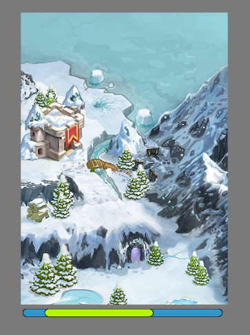
* 滚动视图（水平滚动、垂直滚动），并具备裁切功能（超过视图部分不可见）。 

## ScrollBar

* 滚动条，一般和滚动视图配套使用。有水平滚动条和垂直滚动条两种。

## Sprite

* 精灵动画。可以设置帧动画或者骨骼动画。 
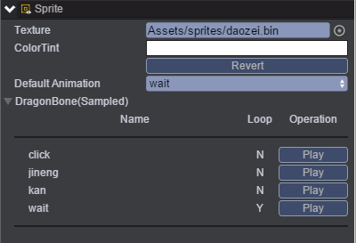 

